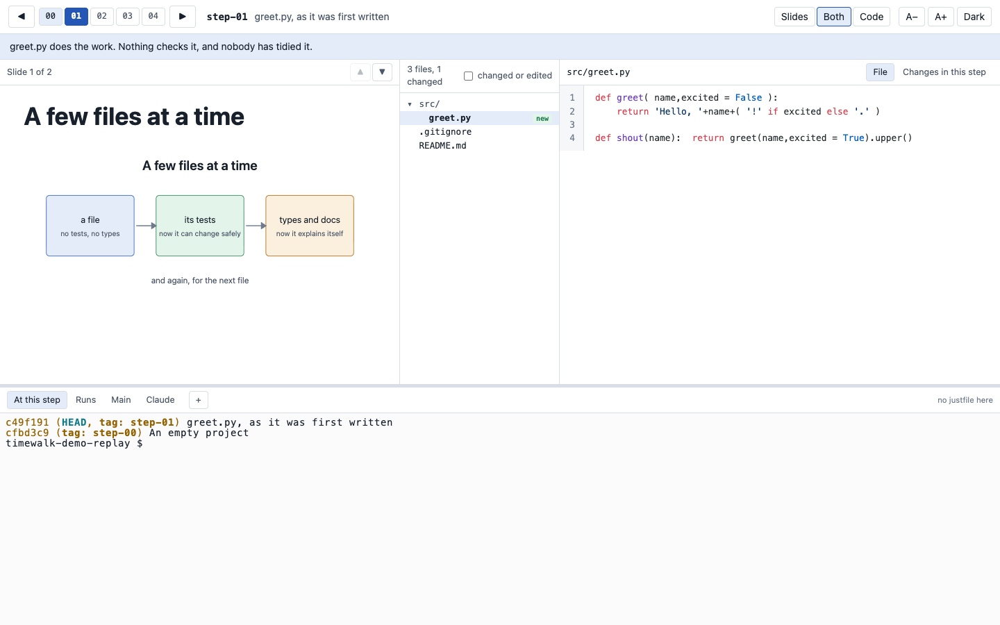

# timewalk

Teach a project by replaying how it was built. timewalk steps through a repository's tags one at a time,
and for each step shows your slides, the files as they were, what the step changed, and real terminals in
the repository at that step. A second page, on your own screen, is the same page with your private notes
beside it and a clock across the top; whatever you do there happens on the projector too.

**Documentation, with screenshots: [rahuldave.com/timewalk](https://rahuldave.com/timewalk/)**



## Try it

```
git clone https://github.com/rahuldave/timewalk
cd timewalk
just demo
```

`just demo` fetches the sample project, [timewalk-demo](https://github.com/rahuldave/timewalk-demo), and
opens it. It prints two addresses: the first for the projector, the second, ending in `/presenter`, for
your screen. Then take [the tour of the demo](https://rahuldave.com/timewalk/demo.html).

On your own project:

```
uv run timewalk.py ~/code/project --notes notes.md --slides slides/slides.toml
```

By default the steps are the tags matching `step-*`, and an annotated tag's message is the note the
audience sees.

## What it does

- **Slides and documents** for each step, from a TOML manifest of Markdown slides, pictures, PDF pages,
  or one longer scrolling document. A PDF handout of them all with `slides_pdf.py`.
- **The files at each step**, with what the step changed, and **live edits**: run `ruff format` at a step
  and the page shows what it changed, as it happens.
- **Terminals** at the step, for long runs, in your own repository, and running Claude Code.
- **Presenter notes** with planned times and one-click commands that run on the projector.
- **Keyboard**: Left and Right for steps, Up and Down for slides.

## What it will not do to your repository

- It never moves it: stepping happens in a second working copy, `<repo>-replay`, a git worktree.
- It never deletes an untracked file, so a run's outputs survive every move.
- It never discards an edit: moving with edits asks, then stashes them.
- The file view cannot write.

More in [The replay copy](https://rahuldave.com/timewalk/replay.html).

## Safety

A terminal in a web page runs commands on your machine. timewalk listens on `127.0.0.1` only, and every
request needs the token in the address it prints, new at each start. **Do not put that address on a
slide or in a recording.** More in [Safety](https://rahuldave.com/timewalk/safety.html).

## Requirements

`uv`, `git`, and a browser. `just` for the recipes, `claude` on the path for the Claude tab, Chrome or
Edge for the PDF handout. Checked in Chrome; Safari and Firefox are not checked.

## Development

```
just test            # the tests
just lint            # ruff
just screenshots     # retake the site's pictures from the demo
just site            # build the site into docs/_site and serve it locally
```

See [Development](https://rahuldave.com/timewalk/development.html). The site's pages are Markdown
in [`docs/`](docs/), published by a GitHub Action.

## Licence

MIT: see [`LICENSE`](LICENSE). The libraries in `static/vendor/` keep their own licences, each in its
folder: ghostty-web (MIT), highlight.js (BSD 3-Clause) and marked (MIT).
