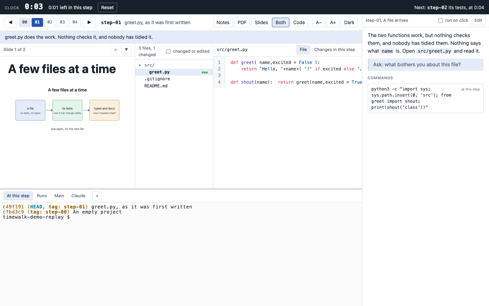

# timewalk

Teach a project through a replay of how its authors built it. timewalk steps through the tags of a
repository one at a time. For each step, it shows your slides, the files as they were, and what the step
changed. It also gives real terminals in the repository at that step.

timewalk serves one page. Open it in a window on the projector and in a window on your own screen. Every
window shows the same step, so what you do on your screen happens on the projector too. With `--notes`,
the page shows the notes of each step beside it, and with `--clock`, a clock across the top.

**Documentation, with screenshots: [rahuldave.com/timewalk](https://rahuldave.com/timewalk/)**



## Try it

```
git clone https://github.com/rahuldave/timewalk
cd timewalk
just demo
```

`just demo` fetches the sample project, [timewalk-demo](https://github.com/rahuldave/timewalk-demo), and
opens it. It prints one address. Open it on the projector and on your own screen. Then take
[the tour of the demo](https://rahuldave.com/timewalk/demo.html). If port 8765 is in use, add
`--port` with another number.

On your own project, run timewalk straight from GitHub with uv. uv downloads it once and keeps it:

```
uvx --from git+https://github.com/rahuldave/timewalk@v1.0.12 timewalk ~/code/project --notes notes.md --slides slides/slides.toml
```

To install the commands `timewalk` and `timewalk-pdf` for good, run
`uv tool install git+https://github.com/rahuldave/timewalk@v1.0.12`.

By default, the steps are the tags that match `step-*`. The message of an annotated tag is the note that
the audience sees. Keep the notes file outside the repository. timewalk refuses a notes file inside it.

## What it does

- **Slides and documents** for each step, from a TOML manifest of Markdown slides, pictures, PDF pages
  and longer documents that scroll.
- **A PDF** of the slides, one page each. The notes are for the page, and are not in it. Make it with the **PDF** button
  or with the command `timewalk-pdf`. The command can give the PDF the font, colours, cover page and
  divider pages of a brand, with `--brand`.
- **The files at each step**, with what the step changed.
- **Live edits.** Run `ruff format` at a step, and the page shows what it changed, as it happens.
- **Terminals** at the step, for long runs, in your own repository, and with Claude Code.
- **Notes**, the script of each step, with planned times and commands. A click types a command into its
  terminal. You can edit the notes on the page.
- **Keyboard.** Left and Right change the step, and Up and Down change the slide.

## What it will not do to your repository

- **It never moves it.** timewalk moves a second working copy, `<repo>-replay`, which is a git worktree.
- **It never deletes an untracked file**, so the outputs of a run stay through every move.
- **It never discards an edit.** A move with edits asks, and then stashes them. The one exception is the
  flag `--discard-edits`, for a replay copy where you keep nothing that you type. With it, a move throws
  edits away and does not ask. It replaces a new file only where the step has a file of the same name.
- **The file view cannot write.** The page writes only the notes file, which lives outside the
  repository.

More in [The replay copy](https://rahuldave.com/timewalk/replay.html).

## Safety

A terminal in a web page runs commands on your machine. timewalk listens on `127.0.0.1` by default, and
every request needs the token in the address it prints, new at each start. On a cloud machine, use an SSH
tunnel, or `--host 0.0.0.0` with a firewall rule for your own address. **Do not put that address on a
slide or in a recording.** More in [Safety](https://rahuldave.com/timewalk/safety.html).

## Requirements

You need `uv`, `git` and a browser. Also install `just` for the recipes, and put `claude` on the path for
the Claude tab. The PDF needs Chrome or Edge. The author checks timewalk in Chrome, and not in Safari or
Firefox.

## Development

```
just test            # the tests
just lint            # ruff
just screenshots     # retake the site's pictures from the demo
just site            # build the site into docs/_site and serve it locally
```

See [Development](https://rahuldave.com/timewalk/development.html). The site's pages are Markdown
in [`docs/`](docs/), published by a GitHub Action.

## Licence

timewalk uses the MIT licence. See [`LICENSE`](LICENSE). The libraries in `src/timewalk/static/vendor/` keep their own
licences, each in its folder. They are ghostty-web (MIT), highlight.js (BSD 3-Clause) and marked (MIT).
