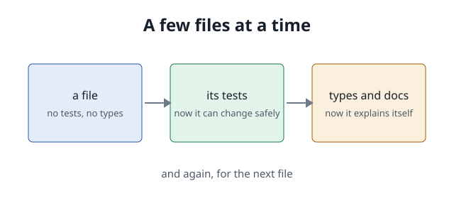

# One function, four steps

- A file arrives the way it was first written
- Then its tests
- Then its types and docs

Watch what a reader can learn from the code at each step.

---

## A few files at a time



---

## Code with nothing around it

```python
def greet(name, excited=False):
    return "Hello, " + name + ("!" if excited else ".")
```

- What is `name`? A string, a list, a user object?
- What happens with an empty name?
- Who would notice if it changed?

---

## Its tests

| Test | Asks |
|---|---|
| `test_plain` | Does a name get a full stop? |
| `test_excited` | Does `excited=True` change the ending? |
| `test_empty_name` | What happens with no name at all? |

Run them with `just test`.

---

## The same function, explained by its signature

- **Types** say what goes in and what comes out
- **A comment beside each parameter** says what it means
- **One line of docstring** says what the function is for

Nothing is written twice.
