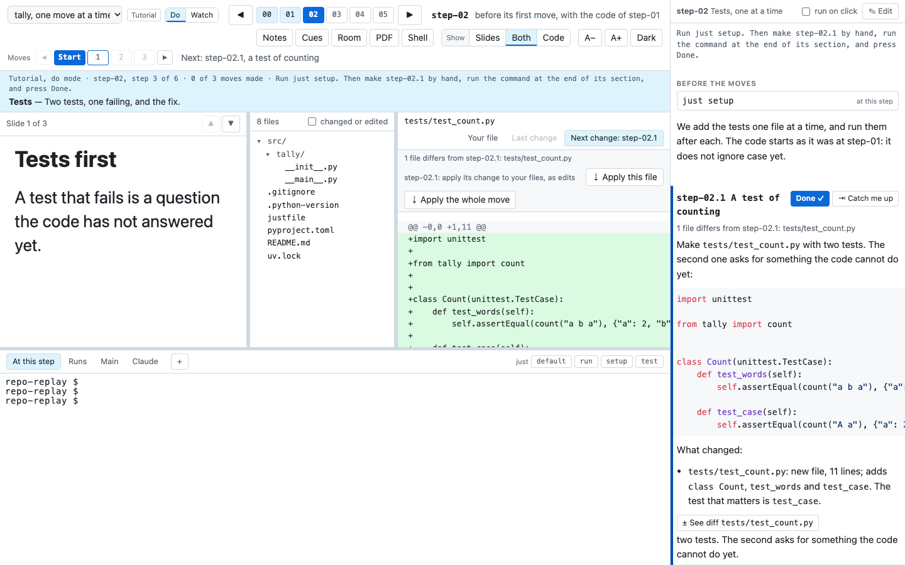
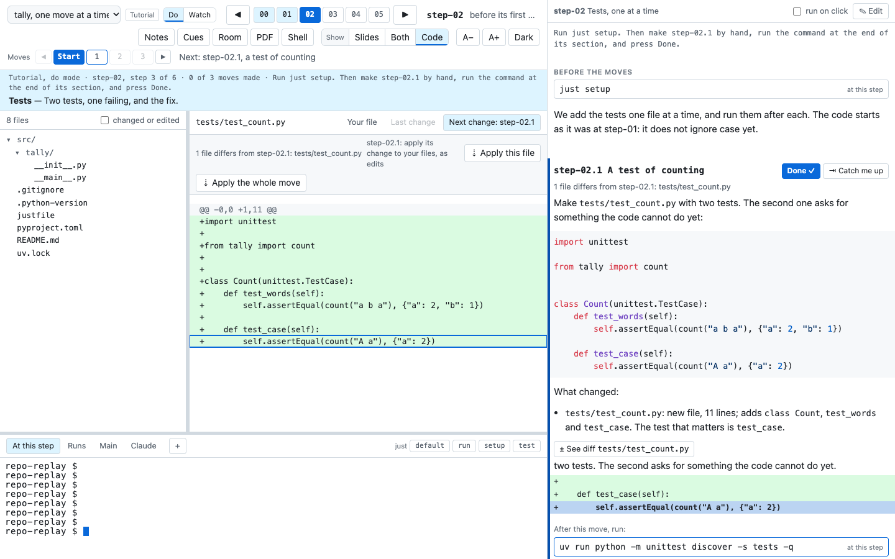

# What a narrative and a tutorial need

This page lists what a walk needs, as checklists. A walk is one path through the history of a project,
with its own notes and slides. A walk is one of two kinds:

- **A narrative** goes from tag to tag. Each tag marks a step.
- **A tutorial** also stops at each small commit between two tags. Each small commit is a move. The class
  makes a step one move at a time.

The first part of the page holds for every walk. The second part adds what a tutorial needs. The last
part gives the checks, in the order to run them.

The class timewalk-test, at github.com/rahuldave/timewalk-test, is a complete example. It has three
narratives and two tutorials, and it meets every demand on this page. To see a feature, clone it and
run `just present`.

## For every walk

### The project is a uv project

uv is the tool that makes the Python environment of a project from its lockfile, `uv.lock`.

- **Make the project a uv project from its first commit.** Commit `pyproject.toml` with `[project]` and a
  build system, `.python-version` and `uv.lock`.
- **Run every command through `uv run` or a `just` recipe.** This rule holds in the notes and in the
  recipes.
- **Never use the Python of the system, and never set `PYTHONPATH`.** The environment of each step comes
  from the lockfile of that step.

### The history

- **Give each step one annotated tag.** The message of the tag is the note that the audience sees.
- **Keep the commits on a straight line.** timewalk finds the moves on the first-parent line, and a
  straight line keeps every commit on it.
- **Name the tags to match the glob of the walk.** The default glob is `step-*`.

See [Making the steps](steps.md).

### The description

- **Give each walk a `description` in `toc.toml`.** Say what the walk is about, in a sentence or two. The
  status band under the step bar shows it at the first step of the walk.
- **Give each tag a short title, a blank line, and then a sentence or two.** The band shows the title in
  bold.

See [The status band](page.md#the-status-band).

### The notes

Keep the notes file outside the repository, in the class folder. Give each step one `## step` section.
Each section has these parts:

- **`$ just setup`** as its first command.
- **What the step is about,** and why the authors made it.
- **The files to read.**
- **Each command, with the result to expect.**
- **Cues and questions for the class.** A cue is a line that starts with `> `.
- **Optionally, `time:`**, the planned start of the step.

Use `runs$` for a command that takes a long time, and `main$` for a command that only reads your
repository. See [Notes](notes.md).

### The slides

- **Give each walk a manifest of its own.** The manifest is the TOML file that says which slides go with
  which step.
- **Give every step an entry, even of one slide.**
- **Keep the slide files and their pictures in a slides folder of a walk.** The page serves slides only
  from those folders.
- **Keep the notes and `toc.toml` out of the slides folders.**
- **Never put a manifest at the top of the class folder.**

See [Slides and documents](slides.md#the-manifest) and [Several walks](walks.md#the-table-of-contents).

### The recipe `just setup`

The `justfile` of the project has a recipe `setup`. It makes the environment and the artifacts of the
step, and nothing more.

- **Make it safe to run again.** A second run changes nothing.
- **Make the environment,** for example with `uv sync`.
- **Make the artifacts** that are missing.
- **Never touch git.** `just setup` makes no commit, branch or tag, and changes no config or hook. A
  step that changes git, for example to install a hook, gives it a recipe of its own. See
  [`just setup` and git](git.md#just-setup-and-git).

### Artifacts

An artifact is a file that a step needs and that git does not hold, for example a corpus or a report.

- **Put each artifact in a folder that git ignores.**
- **Make each artifact the same way each time,** from the files of the step.
- **Make it again when it is missing.** A learner can jump straight to a later step. Then `just setup` at
  that step must make every artifact that the step needs.

## For a tutorial, in addition



### Moves

A move is one small commit between two tags, on the first-parent line. The first-parent line is the
line of commits that git follows back through the first parent of each merge.

- **Start the subject of each move with its name,** for example `step-02.1: a test of counting`.
- **Keep the subject of the step on its last commit,** for example `step-02: the tests pass`. That
  commit carries the tag.
- **Expect no moves in the first step, or in a step of one commit.**
- **Give moves to the first steps after the first one,** for example to step-01. Then the class meets
  moves early.
- **Keep one step without moves after the first step.** Then the class also meets a step of one commit,
  which ends with **Next step**.
- **Give the tutorial every tag of its glob.** A tutorial cannot have `steps = [...]`. For a tutorial on
  one part of the history, make tags of its own for that part, on a branch.

See [Commits for a tutorial](build-walks.md#commits-for-a-tutorial),
[Moves with jj](build-walks.md#moves-with-jj), and [Steps and moves as git](git.md#steps-and-moves-as-git).

### Keep each move small

- **Make each move one atomic action,** small enough to type from the notes. An atomic action is one
  change that makes sense alone, for example one test or one new function.
- **Make each move work alone.** After each move, the anchor commands run and give the result that the
  notes state.
- **Keep each move small enough that its items and excerpts tell the story.** A learner who reads only
  the items, their words and the quoted lines must see what the move did.

### The section of each move

Write the text of the step before its first move section. That text is about the whole step. The notes
column shows it in a section of its own, "Before the moves". Put `$ just setup` there, and say what the
moves do together.

Give each move a `### step-NN.k Title` section, in the order of the commits. Each section has these
parts:

- **The instructions** to make the move by hand, with the code to type.
- **The files changed, as a list.** Start it with "These are the files changed:", or "This is the file
  changed:" for one. Give each file an item of its own. Write its path as it is, in code. Then say what
  happened to it, for example "- `src/tally/__init__.py`: 7 lines added; adds `count`." Do not put the
  files in a sentence of prose. Say which change matters in a sentence after the list. `timewalk-notes` drafts the
  list from the diff.
- **A line `files:`, with items.** Give every item words that say what to look for in the file.
- **A `show:` line for the main line of the move.** Under its item, quote that line of the change. The
  notes draw it as an excerpt, and the reader marks it.
- **One or more anchor commands at the end.** An anchor command shows what the move did. Make it safe to
  run again, and say what it gives. A test that fails is a good anchor, if the notes say that it fails.

```markdown
files:
- diff `src/tally/__init__.py`: one word, `lower()`, answers the failing test.
  show: `for word in text.lower().split():`
```

See [Tutorial walks](walks.md#tutorial-walks) and [The items under files](walks.md#the-items-under-files).



### Write for both modes

A tutorial has two modes, and the class can change the mode at any time.

- **Do mode:** the learner makes each move by hand. So the learner must be able to make the move from the
  notes alone.
- **Watch mode:** timewalk checks out the commit of each move. The code jumps. So the notes and "What
  changed" must say what happened.

### Settings

- **Set `moves = "do"` or `moves = "watch"`** in `toc.toml`, for the mode that the tutorial starts in.
- **Set `sync`** for each walk. With `sync = true`, the default, the slides follow the moves.
- **Quote the slide keys of moves**, for example `"step-02.1" = ["moves.md#1"]`.

## How to check a walk

Run the checks in this order:

1. **Check the notes and the slides** against the steps:

   ```
   timewalk-check repo --toc toc.toml
   ```
2. **For a tutorial, look for missing move sections.** Then write their drafts:

   ```
   timewalk-notes repo --toc toc.toml --walk tutorial
   timewalk-notes repo --toc toc.toml --walk tutorial --write
   ```

   Each draft has a line `files:` with an item for each file of the move. Finish each draft by hand.
   Write the words of each item, and pick the `show:` lines. Then run `timewalk-check` again.
3. **Make the PDF** of each walk:

   ```
   timewalk-pdf --toc toc.toml --walk tutorial
   ```
4. **Run the commands of each walk** at the commit where a learner meets them. See
   [Run the commands of a walk](#run-the-commands-of-a-walk).
5. **Open each walk in two windows.** Go through every step and every move, in do mode and in watch mode.
   In do mode, try **Apply** on each move, and look for "Your files match":

   ```
   timewalk repo --toc toc.toml --walk tutorial
   ```

### What timewalk-check reports

`timewalk-check` stops at the first mistake in `toc.toml`, and reports it as an error:

| Mistake in `toc.toml` |
|---|
| The file cannot be read, or is not valid TOML |
| A table other than `[[walk]]`, or no walk at all |
| A walk with a key that a walk does not have |
| An `id` that is missing, has other characters than letters, digits, `-` and `_`, or is used twice |
| A `kind` other than `"narrative"` or `"tutorial"` |
| A `title`, `description`, `folder`, `notes`, `slides`, `tags` or `setup` that is not text |
| `steps` that is not a list of names, names a step twice, or comes with `tags` |
| `steps` in a tutorial |
| A `moves` value other than `"do"` or `"watch"` |
| A `sync` value other than `true` or `false` |
| A `setup` value other than `"manual"` |
| A `folder` that does not exist |

Then it checks each walk, and reports every problem that it finds:

| Problem | Gives |
|---|---|
| No tag matches the glob of the walk, or a name in `steps` is not a tag | An error |
| In a tutorial, a move whose subject does not start with its name and a colon | An error |
| A notes file or a manifest inside the repository or its replay copy | An error |
| A notes file that does not exist | An error |
| A `##` section for a step that is not in the walk | An error |
| In a tutorial, a `###` section for no move, a move with no `###` section, or sections out of the order of the commits | An error |
| A manifest that does not exist, is not valid TOML, or has a `[slides]` or `[docs]` that is not a table | An error |
| An entry in the manifest for a step or move that is not in the walk | An error |
| A `sync` in the manifest that is not `true` or `false` | An error |
| A step with no entry in the manifest, or an entry that is not a list | An error |
| A slide file outside the class folder, outside the slides folders, or missing | An error |
| A Markdown slide that shows a picture from outside the slides folders | An error |
| A slide number past the end of its Markdown file, or a page past the end of its PDF | An error |
| A PDF that cannot be read | An error |
| A manifest at the top of the class folder, or notes in a slides folder | An error |
| A step with no section in the notes | A warning |
| In a tutorial, a move whose section has no command | A warning |
| In a tutorial, a `diff` item for a file that its move does not change | A warning |
| In a tutorial, a `file` item for a file that is not in the commit of its move | A warning |
| In a tutorial, a `show:` line that is no longer in the change of its item | A warning |
| In a tutorial, an item that names a move that is not in the walk | A warning |
| A walk with notes and no manifest | A warning |
| A slide file in a slides folder that no walk uses | A warning |

`timewalk-check` exits with code 1 when it finds an error. timewalk runs the same checks when it starts,
and does not start after an error.

### Run the commands of a walk

A command in the notes must work at the commit where a learner meets it. timewalk has no command for
this check yet. A future `timewalk-check --run`, or the skills that build classes, can do it. Until then,
run each command at its place:

- **In a narrative,** run the commands of a step at its tag.
- **In a tutorial,** run the commands of a step before its first move at the start of the step. The start
  is the tag before it.
- **In a move,** run the commands of its section at the commit of the move.

A short Python script can do this through the code of timewalk, in a throwaway replay copy:

```python
import subprocess, sys
from pathlib import Path
import timewalk
from timewalk.walks import load_toc

repo_path, toc, walk_id, replay = Path(sys.argv[1]), Path(sys.argv[2]).resolve(), sys.argv[3], Path(sys.argv[4])
walk = next(w for w in load_toc(toc) if w.id == walk_id)
repo = timewalk.Repo(repo_path, replay=replay)     # a replay copy to throw away; a move keeps edits on a saved branch
repo.select(walk.tags, walk.steps, tutorial=walk.kind == "tutorial")
notes = timewalk.parse_notes(walk.notes.read_text())
for step in repo.steps:
    repo.move(step.index)               # a narrative step at its tag; a tutorial step at its start
    names = [m.name for m in repo.moves[step.index]]
    for part in notes.get(step.name, {}).get("parts", []):
        if part["kind"] == "move" and part["name"] in names:
            repo.move(step.index, move=names.index(part["name"]) + 1)   # a move at its own commit
        elif part["kind"] == "command":
            where = repo.main if part["track"] == "main" else repo.work
            done = subprocess.run(part["text"], shell=True, cwd=where)
            print(step.name, repo.position(), "exit", done.returncode, part["text"])
```

In a clone of timewalk, run it with `uv run python run.py repo toc.toml tutorial /tmp/replay`.
Then compare each exit code with what the notes say. A test that the notes say fails gives exit code 1.
