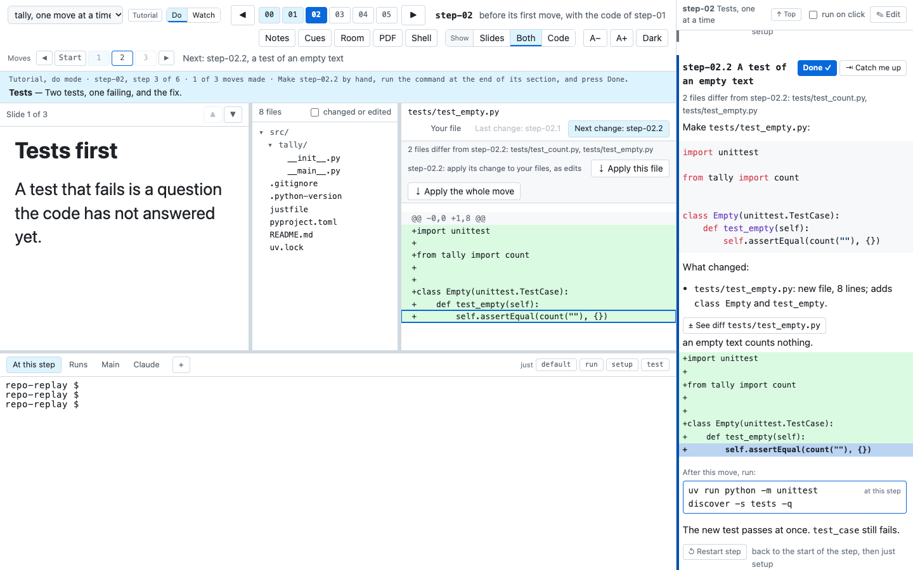

# Build a class with several walks

This page builds a class kit with several walks, from the history of the project to `just present`. A walk
is one path through the history, with its own notes and slides. [Several walks](walks.md) describes each
part in detail. Here the parts come together, in the order that you make them.

The repository timewalk-test, at github.com/rahuldave/timewalk-test, is a complete example. It has five
walks. Two are narratives on every step or on some steps, one is a narrative on tags of its own, and two
are tutorials. Clone
it and run `just present` to see each feature. Its README is a tour. [What a narrative and a tutorial
need](authoring.md) gives the same demands as checklists.



## The parts of a class

A class with several walks has these parts:

| Part | Where | What it holds |
|---|---|---|
| The project | Its own repository | The history: tagged steps, and for a tutorial the small commits between them |
| The table of contents | `toc.toml` in the kit | The list of walks, the default first |
| The default walk | `notes.md` and `slides/` in the kit | The notes and the slides of the first walk |
| Every other walk | `walks/NAME/` in the kit | Its `notes.md`, and `slides/slides.toml` with its slide files |
| The recipes | `justfile` in the kit | `just present`, `just check` and `just pdf` |

The kit is the folder of [Making the steps](steps.md#where-the-class-material-goes), with a table of contents
and a folder for each walk:

```
my-class/
├── toc.toml
├── notes.md                  the default walk
├── slides/slides.toml        its slides
├── walks/
│   ├── tests/
│   │   ├── notes.md
│   │   └── slides/slides.toml
│   └── tutorial/
│       ├── notes.md
│       └── slides/slides.toml
├── justfile
├── repo/                     ignored: a clone of the project
└── worktree/                 ignored: the replay copy
```

## Make the project a uv project

Make the project a uv project from its first commit. The first commit holds `pyproject.toml`, with
`[project]` and a build system, `.python-version` and `uv.lock`. Then every step has its own locked
environment. Run every command of the notes and the recipes through `uv run` or a `just` recipe. Never use the
Python of the system.

### The recipe `just setup`

The `justfile` of the project has a recipe `setup`. The section of every step in the notes starts with
`$ just setup`. A learner runs it first, at every step, in the replay copy.

`just setup` makes two things, and nothing more:

- **The environment,** for example with `uv sync`.
- **The artifacts.** An artifact is a file that a step needs and that git does not hold, for example a
  corpus or a report. `just setup` makes each artifact if it is missing, in a folder that git ignores.

`just setup` never touches git. It makes no commit, branch or tag, and it changes no config or hook. Run
it twice, and the second run changes nothing. A learner can jump straight to a later step, so `just setup`
at that step must make every artifact that the step needs.

```just
# Make the environment of this step: the first command of every step
setup:
    uv sync
    [ -f data/corpus.txt ] || uv run python scripts/corpus.py data/corpus.txt
```

## Make the history

Make the steps as for one walk, with one annotated tag for each step, on one branch. See
[Making the steps](steps.md). Each kind of walk then needs a little more:

- **A walk on some of the steps** needs nothing more. Name its steps in `toc.toml`.
- **A walk on one part, with steps of its own,** needs a branch with tags of its own, for example
  `hooks-00` to `hooks-02`. Start the branch at the step where the part begins.
- **A tutorial** needs small commits between the tags. Each small commit is a move.

### Commits for a tutorial

Make each move a commit of its own, and name it in its subject. The last commit of the step keeps the
subject of the step, and carries the tag:

```
git commit -m "step-02.1: a test of counting"
git commit -m "step-02.2: a test of an empty text"
git commit -m "step-02: case does not matter, and the tests pass"
git tag -a step-02 -m "Tests

Two tests, one failing, and the fix."
```

A step of one commit has no moves, and works as in a narrative.

### Moves with jj

jj, also called Jujutsu, is a version control tool that can share one repository with git. jj calls such a
repository colocated. timewalk reads a colocated repository as it reads any git repository.

In jj, give each move a change of its own, with its message, before you write it. `jj new -m` makes a
new empty change with a message, on top of the change before. The files that you then edit go into that
change. The first move of a step uses `jj describe -m`, because the working copy is already an empty change:

```
jj describe -m "step-02.1: a test of counting"
#   write tests/test_count.py
jj new -m "step-02.2: a test of an empty text"
#   write tests/test_empty.py
jj new -m "step-02: case does not matter, and the tests pass"
#   change src/tally/__init__.py
jj new
```

The last change of the step keeps the subject of the step. The last `jj new` closes that change, so that
its commit does not change again, and starts the empty change for the next step.

jj does not make annotated tags. So tag the step with git, on the commit of the change before the working
copy, `@-`:

```
git tag -a step-02 "$(jj log --no-graph -r @- -T commit_id)" -m "Tests

Two tests, one failing, and the fix."
```

Do not tag the working copy itself, `@`. jj then puts an empty change after it, and that change becomes
a move of the next step.

If you change an earlier move with jj, jj rewrites the later changes, and they get new commits. Then point
the tags at the new commits again.

### Split a step that is one commit

If the history has one commit for a step, split it into moves. First take each group of files from the
tag, one commit at a time:

```
git switch --detach step-01
git checkout step-02 -- tests/test_count.py
git commit -m "step-02.1: a test of counting"
git checkout step-02 -- tests/test_empty.py
git commit -m "step-02.2: a test of an empty text"
git restore --source step-02 --staged --worktree .
git commit -m "step-02: case does not matter, and the tests pass"
```

The last command takes the rest of the step, and removes the files that the step removed. So the last
commit has the same files as the old step-02. Then do these steps:

1. Rebase the later steps on the new commit.
2. Point the tags at the new commits again, as in [How to change an earlier step](steps.md#how-to-change-an-earlier-step).
3. Restart timewalk, which reads the tags when it starts.

## Write the table of contents

List the walks in `toc.toml`. The first walk is the default:

```toml
[[walk]]
id = "narrative"
title = "The project, step by step"
description = "How the project was built, one tagged step at a time."
notes = "notes.md"
slides = "slides/slides.toml"

[[walk]]
id = "tests"
title = "Only the tests"
description = "Three steps of the project: the code, its tests, and a fix."
folder = "walks/tests"
steps = ["step-01", "step-02", "step-05"]

[[walk]]
id = "hooks"
title = "A git hook, one move at a time"
description = "A check that git runs before each commit, shown one commit at a time."
kind = "tutorial"
folder = "walks/hooks"
tags = "hooks-*"
```

Give each walk a `description` of a sentence or two. The status band shows it at the first step of the
walk. [The table of contents](walks.md#the-table-of-contents) lists every key.

## Write the notes and the slides

Write the notes of each walk as for one walk, with one `## step-name` section for each step. Start each
section with `$ just setup`. See [Notes](notes.md).

In a tutorial, give each move a `### step-NN.k` section, in the order of the commits. Let
`timewalk-notes` draft the sections that are missing, and then finish each one by hand:

```
timewalk-notes repo --toc toc.toml --walk tutorial            # print the drafts
timewalk-notes repo --toc toc.toml --walk tutorial --write    # write them into the notes
```

A draft has the title of the move, a list "What changed:" from the diff, a line `files:` and a comment.
Under `files:`, it drafts one item for each file of the move, with no words. Add the instructions to make
the move by hand. Give each item its words, and quote the main line of the change with `show:`. End the
section with its anchor commands.

```markdown
files:
- diff `src/tally/__init__.py`: one word, `lower()`, answers the failing test.
  show: `for word in text.lower().split():`
```

An item is one file to look at, with words. See [The items under files](walks.md#the-items-under-files) and
[Tutorial walks](walks.md#tutorial-walks).

Write a manifest for each walk, with an entry for each step, even of one slide. A manifest can use the
slide files of another walk, with a path from its own folder:

```toml
[slides]
step-01 = ["../../../slides/talk.md#2", "tests.md#1"]
"step-02.1" = ["moves.md#1"]
```

Keep every slide file in a slides folder of a walk. The page serves slides from those folders only. See
[Slides for moves](walks.md#slides-for-moves).

## Add the recipes

These recipes run timewalk from GitHub on the clone of the project. `just present` checks the walks first,
and stops if a check finds an error:

```just
timewalk := "uvx --from git+https://github.com/rahuldave/timewalk@v1.0.14"

# Open the walks: just present, or just present tutorial for another walk
present walk="" *args:
    {{ timewalk }} timewalk-check repo --replay worktree --toc toc.toml
    {{ timewalk }} timewalk repo --replay worktree --toc toc.toml {{ if walk == "" { "" } else { "--walk " + walk } }} {{ args }}

# Check the notes and slides of every walk against the steps
check:
    {{ timewalk }} timewalk-check repo --replay worktree --toc toc.toml

# Make the PDF of one walk's slides: just pdf tests
pdf walk="":
    {{ timewalk }} timewalk-pdf --toc toc.toml {{ if walk == "" { "" } else { "--walk " + walk } }} -o build/slides.pdf
```

## Check and present

1. Run `just check`. It names each problem, for example a step with no slides, a move with no notes, or a
   slide that does not exist. [The checks](walks.md#the-checks) lists them.
2. For a tutorial, run `timewalk-notes` without `--write`. It says if a move has no section.
3. Run the commands of each step and each move, at the commit where a learner meets them. See
   [Run the commands of a walk](authoring.md#run-the-commands-of-a-walk).
4. Run `just present`. Open the **Room** window for the class. Change the walk with the menu in the step bar.
5. Before the class, go through every walk, step and move in two windows, in do mode and in watch mode. See
   [A check the evening before](class.md#a-check-the-evening-before).
