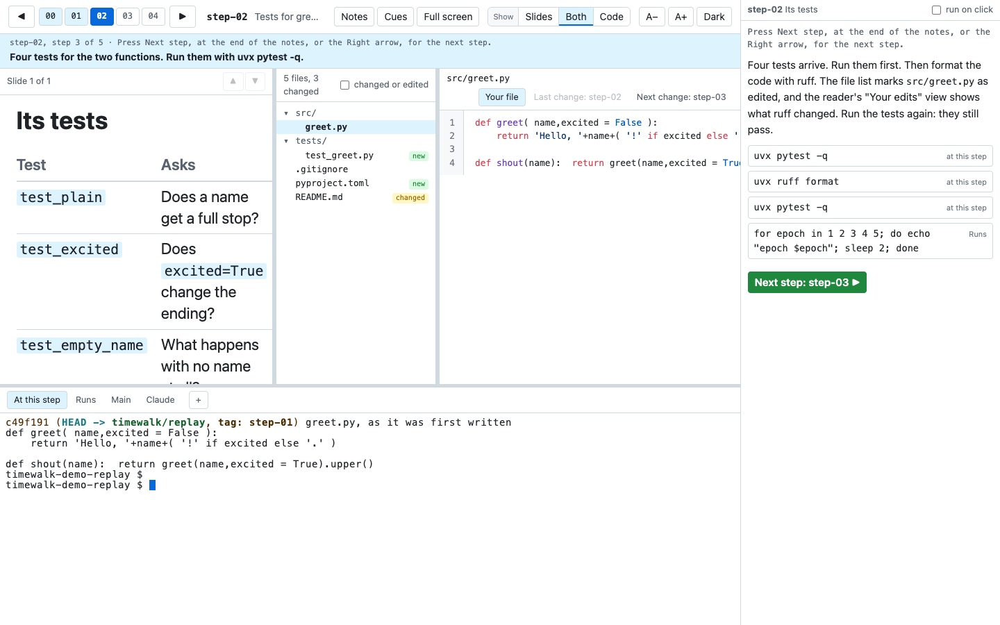

# Teach a class

You teach from your laptop. The class watches a projector, or a shared screen in a video call. timewalk
shows the class the steps, the slides, the code and the terminals, and it keeps your cues on your laptop.
This page shows how to set up the two windows, and what to check before the class starts.

## What you need

- **A projector as a second screen.** In the display settings of your laptop, set the projector to extend
  the desktop, and not to mirror it. With a mirror, the class sees your window, cues included.
- **Chrome or Edge.** They can put the window for the class on the projector by themselves. Other
  browsers open it as a window that you drag there.
- **Your notes, with cues for you.** A cue is a line that starts with `>`, for example `> Say: ...`. See
  [Notes](notes.md).

## Before the class

1. Start timewalk with your notes. For babykev, run `just present` in `babykev-class`. timewalk prints two
   addresses:

   ```
   timewalk: open       http://127.0.0.1:8765/?t=...
   timewalk: for the class, without the cues: http://127.0.0.1:8765/?t=...&cues=off
   ```

2. Open the first address on your laptop. This window is yours. It shows the cues and the clock.
3. Click **Room** in the bar. The first time, the browser asks if the page can manage windows on all your
   displays. Click **Allow**. The window for the class then opens on the projector, at the size of the
   projector.
4. In the window on the projector, click **Full screen**.
5. Go back to your window, and start the clock if you use one.

If the browser cannot place windows, it opens the window for the class on your laptop, and the page says
so. Drag that window to the projector, and click **Full screen** in it.

## What each window shows




| | Your window | The window for the class |
|---|---|---|
| The step, the slide and the layout | Yes | The same, at the same time |
| The open file and its view | Yes | The same |
| Scrolling of the slide, the file and the notes | Yes | Follows yours |
| The terminals | The shells | The same shells |
| The notes and their commands | Yes | Yes |
| The cues, the `>` lines | Yes | No |
| The clock band | Yes, with `--clock` | No |
| **PDF**, **Edit**, **Room** | Yes | No |

## During the class

- **Drive from your window.** Press **Right** for the next step, and **Down** for the next slide. The
  window for the class follows.
- **Click a command in the notes** to type it into its terminal. Press Enter to run it, in your window.
  The class sees the command and its output in the same terminal.
- **Scroll in your window.** The class sees the same part of the slide, the file or the notes.
- **Go back to the top of a slide or a file** with **↑ Top** in its header, or with **Home**.
- **Go back a step when you need to.** Each step comes back where you left it, at the same slide and the
  same scroll of the slide, the notes and the open file.
- **Read your cues** in your window. The class does not see them.

## Things to know

- **The size of a shell.** A shell has one size, and the window that you last typed in sets it. If you
  type in your window, the projector shows the output at the width of your laptop's terminal. To fit the
  projector again, click once into the terminal of the window for the class.
- **A reload.** A reload of either window keeps its choices for cues and notes. If you close the window
  for the class, click **Room** again.
- **A video call.** Share only the window for the class, and not your whole screen.
- **The address is a key.** Anyone on your machine who has the address can run commands as you. Do not
  show it on a slide. See [Safety](safety.md).

## A check the evening before

1. Run `just present`, and open the address on your laptop.
2. Plug in the projector, or a second screen, set to extend.
3. Click **Room**, and allow the browser to manage windows.
4. Move through three steps, and check that the window for the class follows and shows no cues.
5. Click one command, run it, and check the output in both windows.
6. Make the PDF once with **PDF**, if you hand it out.
