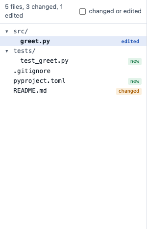
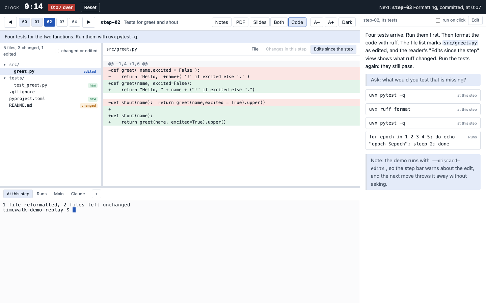
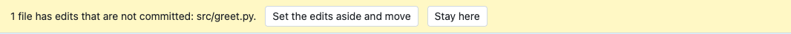
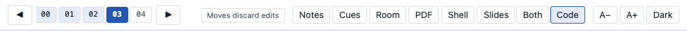
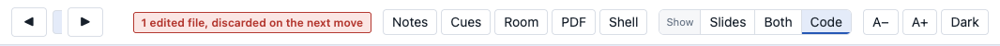

# Live edits

At a step, some commands only read files, for example `pytest` and `git log`. Other commands change files,
for example `ruff format`, `uv lock` or an editor. For the second kind, timewalk shows the changes as
they happen, beside the changes of the step itself.

An edit is a change to a tracked file that nobody has committed yet. A tracked file is a file that git
records. timewalk never throws edits away, but `--discard-edits` changes this rule. The flag is for a
replay copy where you do not need to keep anything from the session. With the flag, a move drops the edits
and does not ask first.

## What you see

Run a command in a terminal at this step, and let it rewrite a tracked file. Within about a second, these
things happen:

- The file list marks the file as **edited**, and the count at the top gives the number of edited files.
- The reader shows a third view, **Edits since the step**. The view shows the diff of the file against the
  commit of the step. A diff is the list of lines that changed.
- A click on an edited file opens it in the **Edits since the step** view.
- The presenter page shows the same. If you open a file on the presenter page, it also opens on the
  projector.

If you run the command again, the view shows the new edits. If you undo the edits with `git restore .`,
the marks go away. The reader then shows the file again.

## The views and the kinds of change

| View | Compares | Answers |
|---|---|---|
| Changes in this step | the step before, and the commit of this step | What did the history do here? |
| Edits since the step | the commit of this step, and the files on the disk | What did we do in the room a moment ago? |
| File | nothing | What is in the file now? |

At step-03 of the demo, the two kinds of change meet. The **Changes in this step** view of `greet.py` is
the same change that ruff made live in front of the class at step-02.

## Moving with edits

Edits belong to the step where you made them. So a move to another step asks first.

- **Stay here** leaves everything as it is.
- **Set the edits aside and move** runs `git stash` and then moves. The stash keeps the edits aside, with
  the label of the step, for example `timewalk: edits made at step-02`. To bring the edits back, run
  `git stash list` and `git stash pop` in a terminal.

timewalk does not discard edits. Only you can discard them, for example with `git restore .` in a
terminal.

### With `--discard-edits`

If you start timewalk with `--discard-edits`, it never asks. A move runs `git checkout --force` to the step.
The move throws away the edits to tracked files.

An untracked file is a file that git does not record. A move replaces an untracked file only where the new
step tracks a file with the same name. Every other untracked file stays.

Use the flag when you do not need to keep anything that the class typed in the replay copy. `just demo`
uses the flag.

Both pages show the flag in the step bar. With no edits, the step bar shows a quiet note:

With edits, the note becomes a warning with the number of edits. If you hover over the **edited** badge or
the **Edits since the step** view, they say the same:

timewalk refuses to start with both `--discard-edits` and `--in-place`. In place, the edits are your real
work that you have not committed, so the flag would throw that work away.

## What counts as an edit

An edit is a change to a **tracked** file, which is a file that the commit of the step has. A command can
also write new files, for example a `.venv`, a database or the output of a run. Git does not track these
new files. They are not edits, the pages do not show them, and a move never touches them. See
[The replay copy](replay.md).

timewalk does not watch for edits in the repository of the **Main** tab, because the page never shows that
repository. See [The terminals](terminals.md).

## How it works

The edits watcher is the part of the server that looks for edits. It checks the replay copy once a second
with `git status`, and it also checks the size and time of each edited file. When anything changes, the
server tells both pages. The diff comes from `git diff HEAD -- <file>` in the replay copy.
