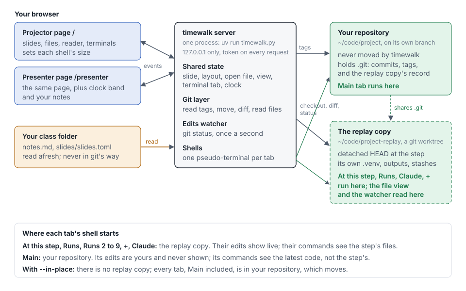

# How timewalk works

timewalk is one server process, one web page, a set of shells, and two working copies of your
repository. You can open the page in one or more windows. This page says what each piece is and where it
is. It also says what each button does in each folder. Then you know what happens before you click.



The picture draws a projector page and a presenter page. Read them as the page, in one or more windows.
Any window can show the notes and, with `--clock`, the clock band.

## The folders

| Folder | What it is | What works in it | Does it move? |
|---|---|---|---|
| **Your repository**, `~/code/project` | The repository that you give to timewalk, on its current branch | The **Main** tab. The recipe buttons, when Main is in front | Never, unless you give `--in-place` |
| **The replay copy**, `~/code/project-replay` | A git clone of your repository, on the branch `timewalk/replay` at the current step | **At this step**, **Runs**, **Runs 2** to **9**, **Claude** and **+**. The file list, the reader, the edits watcher and the recipe buttons | Yes. Each move checks out a step here |
| **Your class folder** | The folder with your notes and slides. timewalk does not use it as a repository | The server reads `notes.md` and the slide files from it again each time. **Save** in the notes column writes one section of `notes.md` | No. timewalk writes only the notes file there |
| **The folder of timewalk** | The code. `uv run` runs it in its own environment, which uv keeps in its cache | Nothing. The shells remove that environment from their `PATH` | No |

A clone is a repository of its own, made from another one. A branch is a name for a line of commits.
HEAD is the commit that a working folder is at.

## Where clones are used, and where not

**Used: the replay copy.** timewalk makes one replay copy for each repository that you browse. The first
start makes it with these commands, in a folder `.project-replay.making` that it then renames:

```
git clone --no-checkout --origin home ~/code/project .project-replay.making
git checkout -B timewalk/replay <the first step's commit>
```

In the replay copy, your repository is the remote `home`. Each later start finds the replay copy, checks
that `home` is your repository, and fetches your branches, HEAD and tags. The replay copy then goes on
from where it stopped. See [The replay copy](replay.md).

**Not used:**

- **Your repository** is the main working copy. The server reads its tags and its commits. It writes
  no config, hook, branch, tag or stash there.
- **With `--in-place`**, timewalk makes no replay copy. Moves check out steps in your repository, and
  every tab, Main too, is in it. The server refuses `--discard-edits` with `--in-place`, so a move cannot
  drop your real work.
- **Your class folder** is never a working copy of anything.
- **The PDF export**, `timewalk-pdf` or the **PDF** button, uses no git. It reads the manifest, the slide
  files and the notes file.

**With `--replay PATH`**, the replay copy goes where you say, and not beside your repository. A walk kit
uses `--replay worktree`, so the replay copy is the folder `worktree/` of the kit.

**The demo** adds one layer. `demo/timewalk-demo` is a git submodule of timewalk. A submodule is a
repository of its own inside another repository. Git keeps the data of this submodule in
`.git/modules/demo/timewalk-demo` of timewalk. The replay copy of the demo, `demo/timewalk-demo-replay`, is
a clone of the submodule, and the git of timewalk ignores it.

**The tests and the screenshots** never touch your repositories or the replay copy of the demo. The
tests make small repositories in temporary folders. `docs/screenshots.py` clones the demo into a
temporary folder, and timewalk makes the replay copy of that clone beside it there.

## A walk kit, in order

A walk kit is a repository that holds the notes and the slides of a walk, and a `justfile`. A student
forks the kit and runs `just present` in it. [Make a walk](walk.md) shows how to make one. These things
then happen, in this order:

1. `just present` runs the recipe `setup` first.
2. If the folder `repo/` does not exist, `setup` clones the project into it. It clones the fork of the
   student, if the student has a fork of the project, and else the upstream project.
3. `setup` adds the upstream project as the remote `upstream`, and fetches its tags. The tags mark the
   steps.
4. `just present` runs timewalk from GitHub with uvx, on `repo/`, with `--replay worktree`. uv downloads
   timewalk the first time, and keeps it in its cache.
5. timewalk makes the replay copy in `worktree/`, if it does not exist. The replay copy is a clone of
   `repo/`, on the branch `timewalk/replay`. The folder keeps its old name.
6. timewalk prints the address of the page. The student opens it.

| Folder of the kit | What it is | What works in it |
|---|---|---|
| The top of the kit | The notes, `walk.md`, the slides and the `justfile`. Tracked in the fork of the student | **Save** in the notes column writes `walk.md` |
| `repo/` | A clone of the project. Git ignores the folder | The **Main** tab. The student commits here, and pushes to their fork of the project |
| `worktree/` | The replay copy of `repo/`. Git ignores the folder | **At this step**, **Runs**, **Claude** and **+**. A move throws away edits here |

## What each control does

| Control | What happens | Git, in which folder |
|---|---|---|
| A step button, **Left**, **Right**, the step arrows | Looks for edits, refuses if an untracked file is in the way, keeps the commits of a learner, moves, and tells every window | `git status`, `git ls-files --others`, `git ls-tree`, `git branch timewalk/saved/<step>` if a learner committed, then `git checkout -B timewalk/replay <step>`, in the replay copy |
| **Set the edits aside and move** | Stashes the edits with the name of the step, then moves | `git stash push -m "timewalk: edits made at step-NN"`, in the replay copy |
| A move, with `--discard-edits` | Moves and does not ask. Edits to tracked files are lost. Commits of a learner are kept | `git checkout --force -B timewalk/replay <step>`, in the replay copy |
| In a tutorial, **Show ▶**, **Catch me up**, or a move button in watch mode | Moves to the commit of a move, as a step button does | The same, with the commit of the move |
| In a tutorial, **Done ✓**, or the button of the next move in do mode | Changes the shared count of moves done. The code does not move | None |
| In a tutorial, **Do** or **Watch** | Changes the shared mode, in every window | None |
| **Up**, **Down**, the slide arrows | Changes the shared slide number. On a document, **Up** and **Down** scroll it, and Alt with **Up** or **Down** changes the slide | None |
| **Show**: **Slides**, **Both**, **Code** | Changes the shared layout, in every window | None |
| **Shell** | Turns Shell mode on or off, in every window. In Shell mode, the window for the class sets the size of each shell | None |
| **Room** | Opens a second window with `room=1` and `cues=off` in its address. In Chrome and Edge, it asks to place windows, and opens the window on the other screen | None |
| **Cues** | Hides or shows the `>` lines of the notes, in this window | None |
| A scroll of the slide, the file or the notes | Sends the place, as a fraction, to every other window over the events socket | None |
| A scroll of a terminal | Sends the number of lines that the terminal is scrolled back, to every other window over the events socket | None |
| The handles between the panes | Change the width of the slides, the file list or the notes, or the height of the terminals, in this browser. A double-click resets a width | None |
| A file in the file list, **Your file** | Reads the file from disk, and refuses paths outside the copy | None. It reads a file in the replay copy |
| **At step-02.3** | In do mode, the file as a move leaves it | `git cat-file blob <move>:<file>`, in the replay copy |
| **Last change** | The diff of the step, or of the move just made, for that file | `git diff <before> <after> -- <file>`, in the replay copy |
| **Next change** | The diff of the next step, or of the next move, for that file | `git diff <before> <after> -- <file>`, in the replay copy |
| **Your edits** | The edits since the commit that the replay copy stands on | `git diff HEAD -- <file>`, in the replay copy |
| **Apply this file**, **Apply the whole move** | Types a command into the **At this step** tab, and runs it | `git diff <before> <move> -- <file> \| git apply --3way`, or `git cherry-pick --no-commit <move>`. The shell writes the files, as edits |
| "Your files match", every two seconds in do mode | Compares the files on the disk with the commit of the move, by content. A match marks the move done, once | None. `git diff --name-only`, `git ls-tree` and `git hash-object` read |
| **Open in VS Code** | A link that opens the file in your editor | None. The editor opens the file |
| **At this step** | A login shell | Starts in the replay copy |
| **Runs**, **Runs 2** to **9**, **+** | More login shells, each with its own process | Start in the replay copy |
| **Claude** | A login shell that types `claude` (or `--assistant`) when it starts | Starts in the replay copy |
| **Main** | A login shell | Starts in your repository |
| A recipe button | Types `just <recipe>` into the tab in front | `just --dump` lists the recipes, in the replay copy, or in your repository when Main is in front |
| A command in the notes | Types the command into its tab, and does not press Enter. That tab comes to the front in every window, and gets the keyboard in the window where you clicked | None until you press Enter. Then the work of the command, in the folder of that tab |
| **run on click**, in the notes column | A click on a command also presses Enter, in this window | The work of the command, in the folder of that tab |
| **Notes** | Shows or hides the notes column, in this window | None |
| **Edit**, then **Save**, in the notes column | Writes the section of the current step into the notes file, unless the section changed in the file since the page read it. Every window then shows the new notes | None. The server writes the notes file in your class folder |
| **PDF** | Makes a PDF of the slides, one page each, and downloads it | None. It reads the manifest and the slide files |
| **Start the clock**, with `--clock` | Records the start time | None |
| (no control, each second) | The edits watcher looks for edits, and tells every window when they change | `git status`, in the replay copy |
| (no control, each second) | The content watcher looks at the notes file, the manifest and each slide file. When one changes, every window draws the notes and the slide again | None |

Each shell starts in its folder. A `cd` in one shell moves that shell and nothing else. The file list
and the reader stay on the replay copy.

## What is kept where

| Kept | Where | Lost when |
|---|---|---|
| The steps, with names, commits and notes | timewalk reads them from the tags when it starts | timewalk reads them again at the next start. Restart after you change the tags |
| The current step | Git, as the HEAD of the replay copy. timewalk asks git again each time | Never. A restart finds the replay copy where it was |
| In a tutorial, the move on show | A file in the git folder of the replay copy, `timewalk-place.json` | Never. A restart comes back at the same move |
| Slide, layout, open file, view, tab in front, clock, and in a tutorial the mode and the count of moves done | The memory of the server, shared by every window | timewalk stops |
| Commits that a learner made | Saved branches in the replay copy, `timewalk/saved/<step>` | You delete them, or you remove the replay copy |
| Where each step was left: its slide, and the scroll of its slide, notes and open file | The memory of the server. A move back to a step brings them back | timewalk stops |
| Each shell, and the last 256 KB of its output | The server, with one process for each tab, on a pseudo-terminal | timewalk stops. The shells end, and their commands end too, unless you started a command with `nohup` and `&` |
| Theme, text size, terminal height, run on click | The local storage of the browser | You clear it |
| If the notes column shows | The session storage of the window | You close the window |
| Edits to tracked files | On disk in the replay copy, or in a stash of the replay copy | You discard them, or the next move discards them, with `--discard-edits` |
| Untracked files, for example `.venv`, outputs and databases | On disk in the replay copy | You delete them, or you remove the replay copy |
| Slides | Your class folder, which timewalk reads again each time | Never. timewalk does not write them |
| Notes | The notes file in your class folder, which timewalk reads again each time. **Save** writes one section of it | Never. **Save** changes only the section of the current step |

A pseudo-terminal is the device that the operating system gives a shell in place of a real terminal.
A tracked file is a file that git records, and an untracked file is a file that git does not record.

If a terminal checks out another commit, the replay copy is no longer at a step. Every window then says
"between steps". To go back, choose a step.

## One move, in order

1. A window asks the server to move to a step. With `--discard-edits`, the server keeps the commits of a
   learner, runs `git checkout --force -B timewalk/replay` to the commit of the step, and goes to step 6.
2. The server asks git for edits to tracked files in the replay copy. If there are edits, and the page did
   not ask to set them aside, the server refuses and names them. The window then asks you.
3. If the window asked to set the edits aside, the server runs `git stash push` with the name of the step.
4. The server lists the untracked files, and the files that the new step tracks. If a path is in both
   lists, the server refuses and names it. A checkout would write over your file.
5. If a learner committed since the last move, the server keeps the commits on a saved branch. Then it
   runs `git checkout -B timewalk/replay` to the commit of the step.
6. The server sets the slide to the one where you left this step. A step that you have not visited starts
   at its first slide. The server then tells every window. Each window then scrolls the slide, the notes and the open
   file to where you left them. It presses Enter in each
   idle shell at the step, so that the shell draws its prompt again. See
   [The terminals](terminals.md#the-prompt-after-a-move).
7. Each window reads the new state, the file list, the recipes, and the notes. An open file stays open,
   and the window reads it again at the new step.

A move does not touch the shells. A command that runs in **Runs** continues, and the files change under
it. See [The terminals](terminals.md#a-long-command-and-a-move).

## One page in several windows

timewalk serves one page, at the address that it prints. Each window on that address keeps a socket to
the server for events. A socket is an open connection between the window and the server, which carries
messages both ways. The old address `/presenter` sends the browser on to the page.

When a window changes the step, the slide, the layout, Shell mode, the open file or the tab in front, it tells the
server. In a tutorial, the mode and the count of moves done are shared too. The server then tells every window. Each window keeps its own choice to show the notes and the cues.

A scroll of the slide, the file or the notes goes to every other window too, as a fraction of the whole. A scroll
of a terminal goes as a number of lines. The browser keeps the theme, the text size, the terminal height and run on click. See [The page](page.md#several-windows).

Every window shows the same shells. Each shell has one size, and the window that you last typed in sets
it. Another window draws the same shell in the space that it has. In Shell mode, the window for the class sets
the size, and the other windows show the same rows and columns.

## Security, in one line

The server listens on `127.0.0.1` only. Each page, request, socket and file needs the token in the
printed address. The token is the secret value after `?t=`. See [Safety](safety.md).
