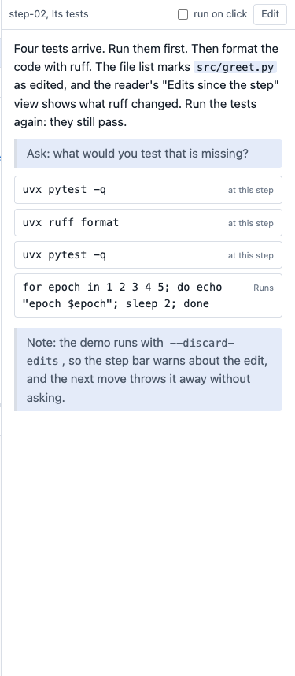
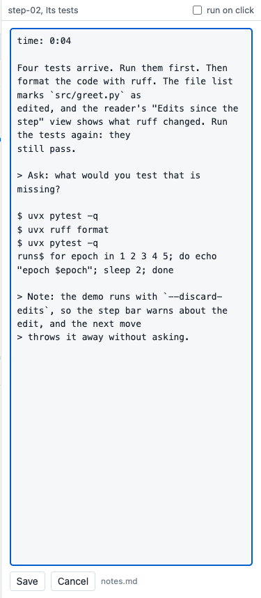
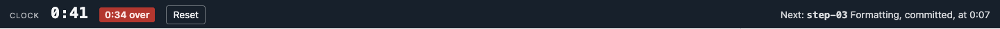

# Notes

The notes are the script of each step. They say what to read, what to say and which commands to run. They
live in one Markdown file, with one section for each step. Give the file to timewalk with `--notes notes.md`. The
page then shows the notes of the current step in a column on its right.



## Where the notes file goes

Keep the notes file outside the repository that the class walks through. timewalk refuses a notes file
inside that repository or inside its replay copy. A move would change a file there, or throw your edits
away.

A good place is the folder or repository that holds the class material, beside the slides. If a student
forks that repository, the edits of the student show in the git of the fork, ready to commit.

## What a notes file holds

```markdown
## step-07 Training
time: 0:37

> Say: start the run first, then read the code while it runs.

The training reads its configuration from one file.

runs$ just train configs/cheese.yaml
$ cat configs/cheese.yaml
main$ git log --oneline
```

| Line | Does |
|---|---|
| `## step-name Title` | Starts the section of a step. The title shows at the top of the notes column, and the PDF uses it in its footer |
| `time: 0:37` | The planned start of the step, in minutes and seconds from the start of the session. The clock band uses it, and shows only with `--clock` |
| `> text` | A cue, for example `> Say: ...` or `> Note: ...`. The notes column shows it on a soft background with a grey left border, apart from the prose |
| `$ command` | A command for the **At this step** tab |
| `runs$ command` | The same, in the **Runs** tab |
| `runs2$ command` to `runs9$ command` | The same, in one more Runs tab, which opens the first time a line uses it. Use it for a second long command while the first command still runs |
| `main$ command` | The same, in the **Main** tab, in your repository |
| other lines | Markdown text to read |

timewalk shows every line of the notes, cues included. If some cues are only for you, remove them from the
copy of the notes that you give to students.

## The notes column

The top of the column shows the name of the step and the title from the notes. Below it, the column
shows the notes in the order of the file. Each command is a button at the place where the notes have it,
between the prose around it. A click on a button types the command into its terminal and brings that tab
to the front in every window. The terminal in the window where you clicked gets the keyboard.

A `$ ` line inside a fenced code block is code to read, and not a command. Use a code block to show a
command that the reader must not run from the page.

By default, a click only types the command. The reader can look at the command, and then press Enter to
run it. To run each command with one click, turn on **run on click** at the top of the column. The
browser remembers this setting.

The **Notes** button in the step bar shows or hides the column in one window. For example, the projector
can hide the notes while your own screen shows them.

If the screen is less than about 1000 pixels wide, the notes column moves under the terminals.

## Edit the notes

To change the notes of the current step, click **Edit** at the top of the column. A text box shows the
section of the step as it is in the file. Change the text, and then click **Save**. timewalk writes that
section of the notes file, and leaves every other section as it is.

Every window shows the new notes at once. If somebody changed the same section in the file after you
clicked **Edit**, timewalk refuses to save, so that it does not overwrite their change. Copy your text,
reload the page, and edit again.



The server also reads the file again at every step, so you can edit the notes in your own editor while
the class runs.

## The clock band

If you start timewalk with `--clock`, a band across the top of the page shows a clock against the planned
times. Without the flag, the page has no clock band.

| Part | Shows |
|---|---|
| The clock | Time since you pressed **Start the clock**. **Reset** stops it |
| The plan | Time left before the next step is due, or in red, how far over you are |
| Next | The name and title of the next step, and its planned time |

The planned times come from the `time:` lines of the notes file. Without them, the band shows only the
clock.



## For a student who works alone

A student who works alone needs only the page. It has the slides, the files, the terminals and the notes.
The notes then work as a runbook, which is a written script of each step with its prose and commands.
Start timewalk without `--clock`, so that the page has no clock band.

## How to write good notes

- **Write what to read and what to do.** The slide shows the idea. The notes give the steps.
- **Put the commands in the order of use.** Also put in commands that undo changes. For example, after a
  command that changes files, add `git restore .`. Then the next move does not need to ask about edits.
  With `--discard-edits`, the move discards the edits, and you need no undo command.
- **Give every step a time** when the plan for the session is clear. Then, with `--clock`, the clock band
  tells you at every step if you are early or late.
- **Try every command at its step before the class.** A command that worked at the last step can fail at
  this step, because the files are different.

## Text between commands

The page takes the commands out of the text and shows them as buttons. So do not end a sentence with a
colon to point at a command. Write "The last command undoes them", and not "Undo them with:".
