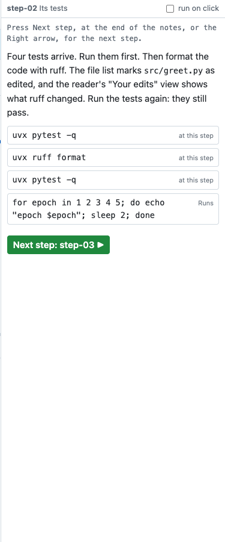

# Notes

The notes are the script of each step. They say what to read, what to say and which commands to run. They
live in one Markdown file, with one section for each step. Give the file to timewalk with `--notes notes.md`. The
page then shows the notes of the current step in a column on its right.


## Where the notes file goes

Keep the notes file outside the repository that the class walks through. timewalk refuses a notes file
inside that repository or inside its replay copy. A move would change a file there, or throw your edits
away.

A good place is the folder or repository that holds the class material, beside the slides. If a student
forks that repository, the edits of the student show in the git of the fork, ready to commit.

## What a notes file holds

```markdown
## step-07 Training
time: 0:37

> Say: start the run first, then read the code while it runs.

The training reads its configuration from one file.

runs$ just train configs/cheese.yaml
$ cat configs/cheese.yaml
main$ git log --oneline
```

| Line | Does |
|---|---|
| `## step-name Title` | Starts the section of a step. The title shows at the top of the notes column, and the PDF uses it in its footer |
| `time: 0:37` | The planned start of the step, in minutes and seconds from the start of the session. The clock band uses it, and shows only with `--clock` |
| `> text` | A cue, for example `> Say: ...` or `> Note: ...`. The notes column shows it on a soft background with a grey left border, apart from the prose |
| `$ command` | A command for the **At this step** tab |
| `runs$ command` | The same, in the **Runs** tab |
| `runs2$ command` to `runs9$ command` | The same, in one more Runs tab, which opens the first time a line uses it. Use it for a second long command while the first command still runs |
| `main$ command` | The same, in the **Main** tab, in your repository |
| `### step-NN.k Title` | In a tutorial walk: starts the section of move `k` of step `NN`, for example `### step-02.1 A test of counting`. Write the sections in the order of the commits. See [Tutorial walks](walks.md#tutorial-walks) |
| `files:` | Starts a list of items, the files to look at. If the line has no items, the page shows a **± See diff** button for each file that the commit of the move added or changed |
| ``- diff `path`: words`` | Under `files:`, an item: a button **± See diff path** that opens the change of the move, or of the step, to that file, and its words. The words can go on in an indented line under it |
| ``- file `path`: words`` | An item: a button **▤ See file path** that opens the file itself. In do mode, for a move not made yet, it opens the file as the move leaves it |
| ``- diff step-02.1 `path`: words`` | An item for another move, named before the path |
| ``  show: `a line` `` | Under an item: one line of the change. The notes draw it as an excerpt of the real diff, with the line shaded, and the reader marks the line |
| other lines | Markdown text to read |

timewalk shows every line of the notes, cues included. If some cues are only for you, remove them from the
copy of the notes that you give to students.

## The notes of a move

In a tutorial walk, each move of a step has a section of its own, under the `## step` section. A move is
one small commit between two tags. A move section gives the instructions to make the move by hand, a
list of what changed, a line `files:` with items, and commands. `timewalk-notes` drafts the sections from the
commits. See [Draft the notes of the moves](walks.md#draft-the-notes-of-the-moves).

The text of a step before its first move section is about the whole step. Put `$ just setup` there, and
say what the moves of the step do together.

```markdown
### step-02.2 A test of an empty text

Make `tests/test_empty.py`, with one test that counts the words of an empty text.

What changed:

- `tests/test_empty.py`: new file, 8 lines; adds `class Empty` and `test_empty`.

files:
- diff `tests/test_empty.py`: an empty text counts nothing.
  show: `self.assertEqual(count(""), {})`

$ uv run python -m unittest discover -s tests -q

The new test passes at once.
```

An item is one file to look at, with words that say why. On the page, each item is one button, **± See
diff** or **▤ See file** with the path, and the words go on the line under it.

A `show:` line quotes one line of the change. The notes column draws it as an excerpt, a small part of the
real diff, read only. A click on the excerpt opens the change, as **± See diff** does. The excerpt comes
from the commits each time, so the notes never hold a copy of the diff. See
[The items under files](walks.md#the-items-under-files).

The last commands of a move section are its anchor commands. The notes column shows them under the label
"After this move, run:". An anchor command shows what the move did, and the notes say what it gives. Make
it safe to run again, and keep it from changing tracked files. A test that fails is a good anchor command,
if the notes say that it fails. See [Anchor commands](walks.md#anchor-commands).

## The notes column

The top of the column shows the name of the step in bold, and the title from the notes. The first line
of the notes says what to do now, in the font of the code, as the status band does. See
[The status band](page.md#the-status-band).

Below that line, the column shows the notes in the order of the file. Each command is a button with a border, at the
place where the notes have it, between the prose around it. A click on a button types the command into
its terminal and brings that tab to the front in every window. The terminal in the window where you clicked gets the keyboard.

A `$ ` line inside a fenced code block is code to read, and not a command. Use a code block to show a
command that the class must not run from the page.

By default, a click only types the command. You can look at the command, and then press Enter to
run it. To run each command with one click, turn on **run on click** at the top of the column. The
browser remembers this setting.

The **Notes** button in the step bar shows or hides the column in one window. The **Cues** button shows
or hides only the cues, the lines that start with `>`, in one window. The prose and the commands stay. In
a class, the window on the projector hides the cues, and your own window shows them. See
[Teach a class](class.md).



Code in a sentence has the font of the code, and no shade. A fenced code block, and an excerpt of a
diff, is a band across the whole width of the column, with no border. The notes and the reader colour the
code with the GitHub theme of highlight.js, light or dark, as the page is. highlight.js is the library
that colours the code. See [The theme](page.md#the-theme).

When the step has no moves, or when every move of the step is made, a green **Next step** button ends the
notes. It names the next step, and goes to it in every window. The last step has no such button.

If the screen is less than about 1000 pixels wide, the notes column moves under the terminals.

### The notes of a step with moves

In a tutorial, the notes column draws a step with moves in sections:

- **Before the moves.** The text before the first move section is a section of its own, with this label.
  The text is about the whole step.
- **A section for each move.** The sections have no boxes. Each one runs from edge to edge of the column,
  with a bar on its left. The bar is dark for the move on show and blue for the next move. A move made
  has a grey bar and a check. The moves after the next one are faded.
- **The button of each move.** The next move has **Show ▶** in watch mode, or **Done ✓** in do mode. A
  move already made keeps a grey button that does nothing, **Shown ✓** or **Made ✓**.
- **↺ Restart step.** Once a move is made, each section of a move made ends with this button, and so does
  the section of the move on show. It goes back to the step's **Start** in every window, with the code of
  the step before. If the replay copy has edits, the page asks first. With `--discard-edits`, the move drops
  them. The notes then go to the top, where `just setup` is.
- **Next step.** When every move is made, the green **Next step** button ends the notes.

See [Moves on the page](walks.md#moves-on-the-page).


## Edit the notes

To change the notes of the current step, click **✎ Edit** at the top of the column. A text box shows the
section of the step as it is in the file. Change the text, and then click **Save**. timewalk writes that
section of the notes file, and leaves every other section as it is.

Every window shows the new notes at once. If somebody changed the same section in the file after you
clicked **✎ Edit**, timewalk refuses to save, so that it does not overwrite their change. Copy your text,
reload the page, and edit again.


The page also reloads the notes by itself. When you save the notes file in your editor, or a `git pull`
changes it, every window shows the new notes within about a second. A section that you are editing in the
text box stays as it is until you save it.

## The clock band

If you start timewalk with `--clock`, a band across the top of the page shows a clock against the planned
times. Without the flag, the page has no clock band.

| Part | Shows |
|---|---|
| The clock | Time since you pressed **▶ Start the clock**. **↺ Reset** stops it, and sets it back to 0:00 |
| The plan | Time left before the next step is due, or in red, how far over you are |
| Next | The name and title of the next step, and its planned time |

The planned times come from the `time:` lines of the notes file. Without them, the band shows only the
clock.


## For a student who works alone

A student who works alone needs only the page. It has the slides, the files, the terminals and the notes.
The notes then work as a runbook, which is a written script of each step with its prose and commands.
Start timewalk without `--clock`, so that the page has no clock band.

## How to write good notes

- **Write what to read and what to do.** The slide shows the idea. The notes give the steps.
- **Put the commands in the order of use.** Also put in commands that undo changes. For example, after a
  command that changes files, add `git restore .`. Then the next move does not need to ask about edits.
  With `--discard-edits`, the move discards the edits, and you need no undo command.
- **Give every step a time** when the plan for the session is clear. Then, with `--clock`, the clock band
  tells you at every step if you are early or late.
- **Try every command at its step before the class.** A command that worked at the last step can fail at
  this step, because the files are different.

## Text between commands

The page takes the commands out of the text and shows them as buttons. So do not end a sentence with a
colon to point at a command. Write "The last command undoes them", and not "Undo them with:".
