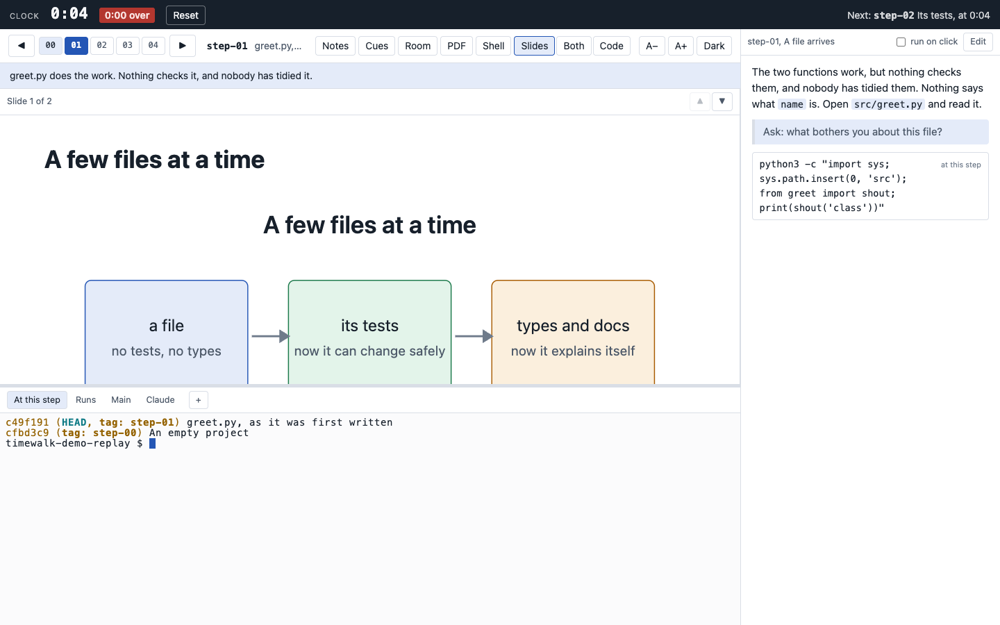
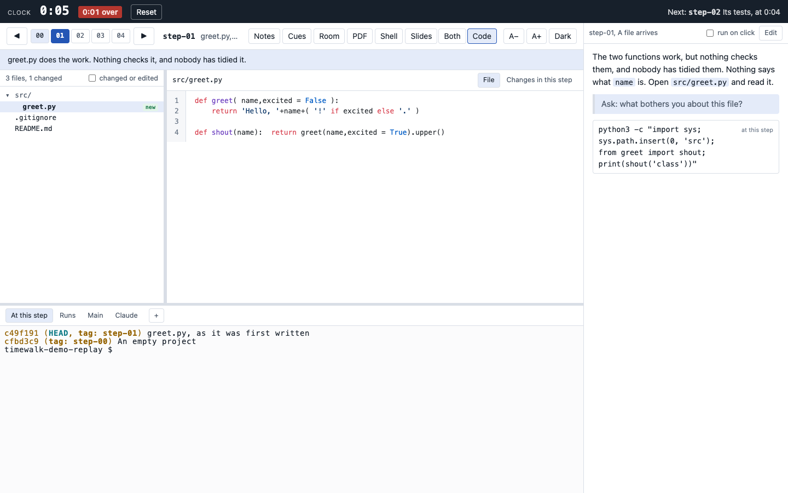
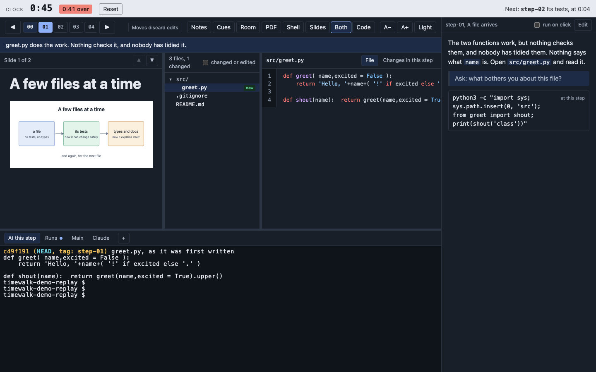
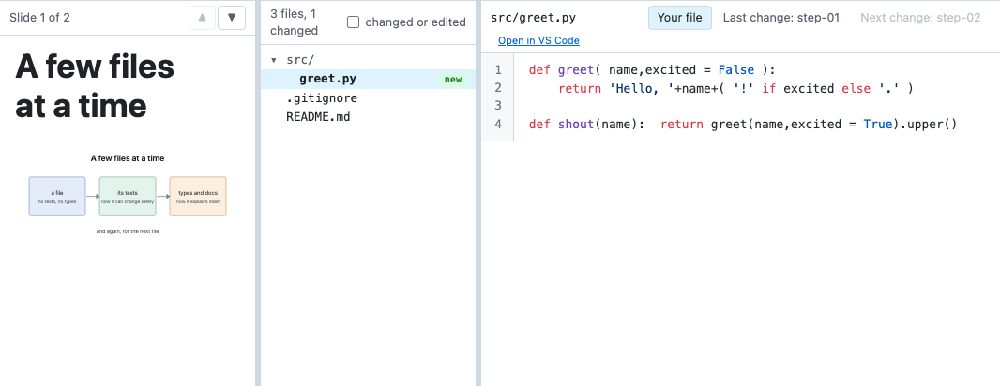
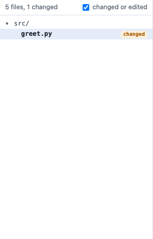
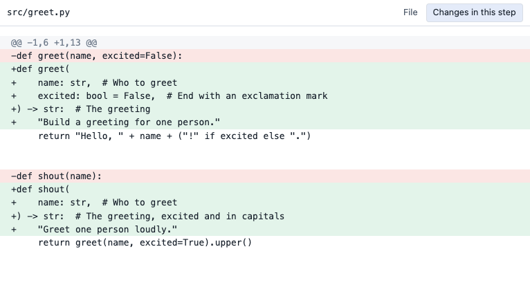
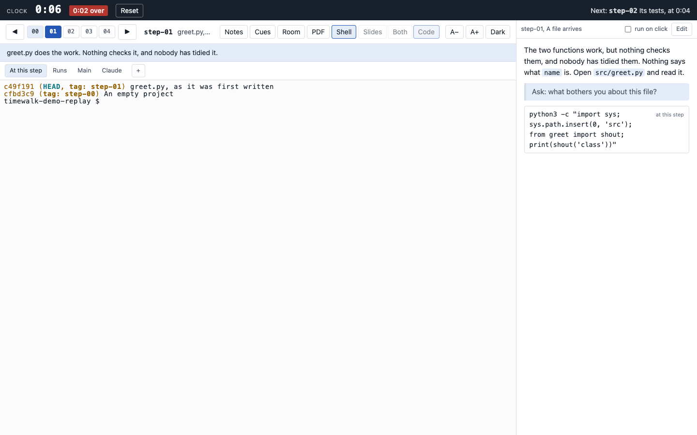

# The page

timewalk serves one page, at the address it prints. Everything on the page follows the step of the replay
copy. The replay copy is the second working copy that timewalk moves from step to step.

## Several windows

You can open the address in more than one window, for example one on the projector and one on your own
screen. Every window shows the same step, so you can control the room from your own screen. The server
keeps the shared state, and it sends each change to every window.

| Shared by every window | Kept by each window | Kept by each browser |
|---|---|---|
| The step | If the notes show | The theme, dark or light |
| The slide | If the cues show | The text size |
| Slides, Both or Code, and Shell | Which terminal has the keyboard | The height of the terminals |
| The open file, and its view | | If a click on a command runs it |
| The scroll position of the slide, the file, the notes and each terminal | | The widths of the slides, the file list and the notes |
| The terminal tab in front | | |
| The terminals themselves: the same shells | | |

When you scroll a slide, a file or the notes, every other window scrolls to the same place. Because the
windows can differ in size, the place is a fraction of the whole. Half way down in one window is half way
down in every window. A terminal is different. When you scroll a terminal back, every other window scrolls the
same shell back by the same number of lines. To teach with one window for you and one for the class, see [Teach a class](class.md).

Each step also remembers where you left it. Move from step 6 to step 7 and back, and step 6 comes back at
the same slide. The slide, the notes and the open file also come back at the same scroll. A step that you have
not visited yet starts at its first slide, at the top. timewalk keeps this memory while it runs.

A setting of the browser applies to every window of that browser. To give the projector another theme or
text size, open its window in another browser, or in a private window.

A shell has one size. The window that you last typed in sets the size. A window that only shows a
terminal leaves its size alone, so two windows of different sizes do not fight over it.

## The step bar

The step bar has one button for each step, with numbers from 00. A step is a point in the history, and by
default it is a git tag that matches `step-*`. The bar fills the button of the current step, and shades
the buttons of earlier steps.

Next to the buttons, the bar shows the name of the step and the subject of its commit. Under them, a band
shows the message of the tag, which is the note that the audience sees.

To go to a step, do one of these:

- Click its button.
- Click an arrow button.
- Press **Left** or **Right** on the keyboard.

Sometimes the replay copy is on a commit that is not a step, for example after someone runs `git checkout`
in a terminal. Then the bar says "between steps". To go back, choose a step.

If you start timewalk with `--discard-edits`, the bar also says "Moves discard edits". When files have
edits, the note becomes a red warning with a count of the edited files. The next move throws those
edits away. See [Live edits](edits.md#with---discard-edits).

## The buttons on the right of the bar

| Button | Does |
|---|---|
| **Notes** | Shows or hides the notes column in this window. The button shows when timewalk has a notes file |
| **Cues** | Shows or hides the cues in this window, the lines of the notes that start with `>`. The prose and the commands stay |
| **Room** | Opens the window for the class: on the projector at full size where the browser allows it, with no cues and no clock band. See [Teach a class](class.md) |
| **Full screen** | Only in the window for the class. Fills the screen with that window |
| **PDF** | Makes a PDF of the slides, one page each, and downloads it |
| **Shell** | Gives the terminals the space of the slides, the file list and the reader, in every window. The notes stay. Press it again to go back. See [Shell](#shell) |
| **Slides**, **Both**, **Code** | Choose what fills the page, in every window |
| **A−**, **A+** | Change the size of all the text in this window. The terminals use the same size |
| **Dark**, **Light** | Change the theme of this window |

The **PDF** button makes the same PDF as the export command, without the notes, which are for this page. The export uses the browser on your machine, so it can take a few seconds. See
[Slides and documents](slides.md#a-pdf-of-the-slides).

## The widths of the panes

Thin handles sit between the panes. Drag a handle to change how much room each pane gets.

- **The handle between the slides and the file list** changes the width of the slides. Make the slides
  narrow to show more code, and wide again for the next slide.
- **The handle between the file list and the reader** changes the width of the file list.
- **The handle on the left edge of the notes** changes the width of the notes column. On a narrow
  screen, where the notes sit under the terminals, the handle is on their top edge and changes their
  height.
- **The bar above the terminals** changes the height of the terminals.

To put a handle back to its default width, double-click it. The browser remembers the widths. The
handle of the slides shows only in the **Both** layout.

## Back to the top

When you scroll down a slide, a file or the notes, an **↑ Top** button shows in the header of that pane.
Click it to go back to the top. The button hides again at the top. **↑ Top** goes to the top of one long
slide. To go to the first slide of the step, use **⇤ First**, as in [Slides](#slides).

The keys **Home** and **End** take the pane under the mouse to its top or its bottom. Both are ordinary
scrolls, so every other window follows, and the step remembers the place.

## Slides

The slides pane shows the slides for the step, from the manifest. The manifest is the TOML file that says
which slides go with which step. The top of the pane shows the number of slides and the arrows. If the step
has more than one slide, **Up** and **Down** change the slide.

Past the first slide, a **⇤ First** button
shows beside the arrows. Click it to go back to the first slide of the step. **Shift+Up** goes to the
first slide too, and **Shift+Down** goes to the last.

A step can show one longer Markdown **document** instead, or a document among its slides. A document
scrolls, and **Up** and **Down** scroll it. A line such as `$ uvx pytest -q` on a slide or in a document
is a command button, as in the notes. See [Slides and documents](slides.md#commands-on-a-slide).

## The file list

The file list shows the tracked files of the replay copy as a tree. A tracked file is a file that git
records. The list marks the files that the step added as **new**, and the files that it modified as
**changed**. The list shows the files that the step removed under the tree.

An edit is a change to a tracked file that nobody has committed yet. If a command in a terminal edited a
file after the commit of the step, the list marks the file as **edited**. To see the size of the step in
lines, hover over the count at the top.

The **changed or edited** box shows only those files. On a large project, folders with no changes start
closed.

## The reader

The reader is the pane that shows one file. To read a file, click it in the file list. The reader has up
to three views:

| View | Shows |
|---|---|
| **File** | The file as it is on the disk now |
| **Changes in this step** | What the commit of the step changed in the file, against the step before |
| **Edits since the step** | The edits to the file since the commit of the step. The view shows only when the file has edits |

You cannot edit a file in the reader. The reader shows new edits within about a second. See
[Live edits](edits.md).

## The notes column

If you start timewalk with `--notes`, a column on the right shows the notes for the step. The notes hold
the prose of the step, its cues and its commands. See [Notes](notes.md).

## The terminals

A row of tabs goes along the bottom of the page. Each tab is a terminal with a real shell, the program
that runs your commands.

- **At this step** and **Runs** run in the replay copy.
- **Main** runs in the repository that you gave to timewalk.
- **Claude** starts Claude Code at this step.
- **+** opens more terminals.

See [The terminals](terminals.md).

## Recipes

A recipe is a task in a `justfile`, which you run with `just`. If the folder of a terminal has its own
`justfile`, its public recipes show as buttons beside the tabs. A click types `just <recipe>` into the
terminal in front and runs it. timewalk reads only a `justfile` in that folder. It ignores a `justfile` in
a parent folder, because that file belongs to another project.

If a recipe needs an argument, the click types the command but does not run it. You then finish the
command. The page highlights the recipes that are new at this step. If **Main** is in front, the buttons
show the recipes of your repository. A folder with no `justfile` shows no recipe buttons.

## Shell

**Shell** gives the terminals the whole space of the slides, the file list and the reader. Use it when the
class works in the shell for a while. Every window follows, as with the layout. The notes column stays. Press
**Shell** again, or Alt+Enter, and the page shows the layout that it had before.

In Shell mode, the window for the class sets the size of each shell. The class reads the projector, so the
shell takes the rows and columns of the projector. Your window shows the same rows and columns, and makes its
text smaller or larger to fit them. When Shell is off, the window that you last typed in sets the size again.
Without a window for the class, Shell mode keeps that rule too.

## The keyboard

| Key | Does |
|---|---|
| Left, Right | The previous or next step |
| Up, Down | The previous or next slide, when the step has more than one. On a document, or with one slide, they scroll |
| Alt with an arrow | Moves the step or the slide, from anywhere, a terminal included |
| Shift+Up, Shift+Down | The first or the last slide of the step |
| Home, End | The top or the bottom of the slide, the file or the notes under the mouse |
| Alt+Enter | **Shell** on or off |
| Alt+1, Alt+2, Alt+3 | **Slides**, **Both**, **Code** |
| Alt+\` | **Slides** or **Code**: from one to the other |
| Alt+N | Shows or hides the notes, in this window |

The Alt keys work everywhere, a terminal included. On a Mac, Alt is the Option key.

The page keeps the arrow keys until you click into a terminal. Then the terminal has the keys, and a blue
edge around it shows this. The arrows then move through the history of your shell.

To give the keys back to the page, click anywhere else. A command that you click in the notes column also
gives its terminal the keys, in the window where you clicked.

