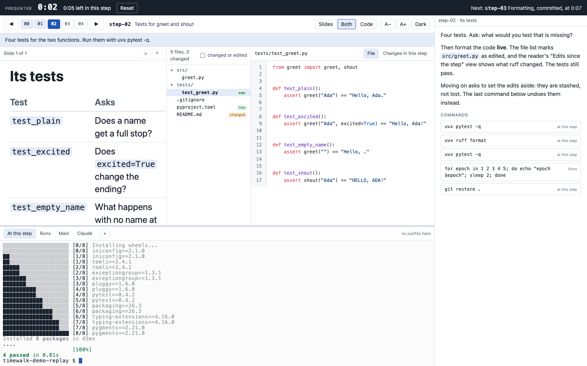

# The presenter page

The page at the second address, ending in `/presenter`, for your own screen. It is the
[projector page](projector.md), with two things added: a band across the top with the clock and what
comes next, and a column on the right with your notes for the step and their commands.

## One page, two screens

The projector and the presenter page show the same thing. The server keeps what is shown, and every
change made on either page is sent to both:

| Shared by both pages | Each page's own |
|---|---|
| The step | The theme, dark or light |
| The slide | The text size |
| Slides, Both or Code | The height of the terminals |
| The open file, and its view | Where a file or slide is scrolled to |
| The terminal tab in front | Which terminal has the keyboard |
| The terminals themselves: the same shells | |

So you drive the room from your screen: press **Right** and the projector moves; choose **Code** and the
projector shows the code; open `greet.py` in **Changes in this step** and the class sees it. What you see
is what they see, with your notes beside it.

## The band

| Part | Shows |
|---|---|
| The clock | Time since you pressed **Start the clock**. **Reset** stops it |
| The plan | Time left before the next step is due, or how far over you are, in red |
| Next | The next step's name and title, and when it is planned |

The planned times come from `time:` lines in your notes. Without them the band shows the clock alone.

## The notes column

Your notes for the step, as Markdown, headed by the step's name and the title from your notes. Below them
are the step's commands, one button each. A click types the command into its terminal and runs it,
brings that tab to the front on both pages, and gives the projector's terminal the keyboard. See
[Presenter notes](notes.md).

The notes are read afresh at every step, so you can edit the file while presenting. The projector page
never asks for them.

## The keyboard

The same as the projector page. **Left** and **Right** move steps, **Up** and **Down** change slides when
there is more than one, and Alt with an arrow works even inside a terminal. A terminal has the keys only
after you click into it.

## On a narrow screen

Below about 1000 pixels wide the notes move under the terminals, so a laptop screen still has room for
the code.
