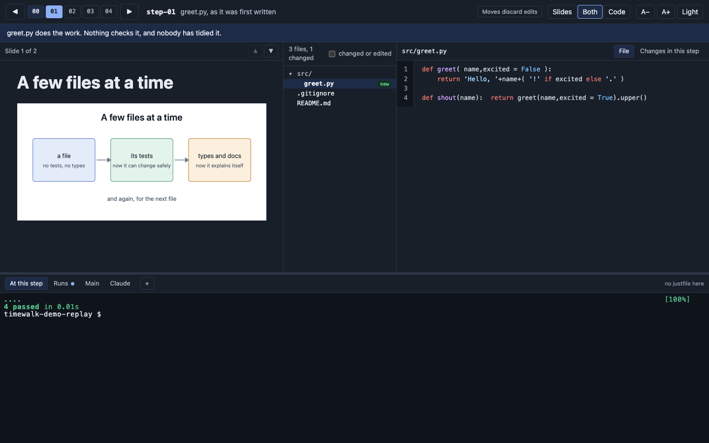

# The projector page

The page at the first address, for the room. Everything on it follows the step the replay copy stands
on. The [presenter page](presenter.md) is this same page with your notes beside it: the step, the slide,
the layout, the open file and the terminal tab are shared, so a change on either page shows on both.

## The step bar

One chip per step, numbered from 00. The current step is filled, earlier ones are shaded. Next to the
chips are the step's name and the commit's subject; under them, in a band, is the tag's message, the
note the audience sees. Click a chip to go to that step, or use the arrow buttons, or **Left** and
**Right** on the keyboard.

If the replay copy is on a commit that is not a step (someone ran `git checkout` in a terminal), the bar
says "between steps". Choose a step to return.

Started with `--discard-edits`, the bar also says "Moves discard edits", and turns it into a red warning
counting the edited files when there are any: the next move throws them away. See
[Live edits](edits.md#with---discard-edits).

## Three layouts

**Slides**, **Both** and **Code**, at the top right, choose what fills the page, on both pages at once.
A step with no slides shows the code whatever is chosen.

**A−** and **A+** change the text size of everything, terminals included. **Dark** and **Light** switch
the theme. Drag the bar above the terminals to give them more or less room. These three are each page's
own, remembered in its browser, so the projector and your screen can differ.

## Slides

The slides for this step, from the slides manifest. The count and the arrows are at the top of the pane.
**Up** and **Down** change slide when the step has more than one. A step can instead show one longer
Markdown **document**, which scrolls and has no arrows. See [Slides and documents](slides.md).

## The files

The tracked files of the replay copy, as a tree. Files the step added are marked **new**, files it
modified **changed**, and files it removed are listed under the tree. Files edited since the step's
commit, by a command run in a terminal, are marked **edited**. Hover over the count at the top for the
step's size in lines.

**changed or edited** lists only those files. On a large project, folders with nothing changed start
closed.

## The reader

Click a file to read it. It has up to three views:

| View | Shows |
|---|---|
| **File** | The file as it is on disk now |
| **Changes in this step** | What the step's commit changed in it, against the step before |
| **Edits since the step** | What has been edited in it since the step's commit. Shown only when there are edits |

Files cannot be edited here. The reader follows edits as they happen: see [Live edits](edits.md).

## The terminals

Along the bottom, a row of tabs, each a real shell. **At this step** and **Runs** are in the replay copy,
**Main** is in the repository you started from, **Claude** starts Claude Code at this step, and **+**
opens more. See [The terminals](terminals.md).

## Recipes

When the step has a `justfile`, its public recipes are buttons beside the tabs. A click types
`just <recipe>` into the terminal in front and runs it; a recipe that needs an argument is typed and left
for you to finish. Recipes that are new at this step are highlighted. With **Main** in front, the buttons
are the main repository's recipes.

## The keyboard

| Key | Does |
|---|---|
| Left, Right | The previous or next step |
| Up, Down | The previous or next slide, when the step has more than one. Otherwise they scroll |
| Alt with an arrow | The same, from anywhere, a terminal included |

The page keeps the arrow keys until you click into a terminal. The terminal then has them, shown by a
blue edge around it, and the arrows move through your shell's history. Click anywhere else to give them
back. A command sent from the presenter page also gives its terminal the keys.

