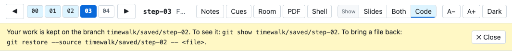

# The replay copy

timewalk never moves the repository that you give it, and never writes to it. [What timewalk does with
git](git.md) lists every git command and ref that the replay copy involves, and why. It moves a second working
copy instead, the replay copy. timewalk makes the copy beside your repository and names it
`<repo>-replay`.

```
timewalk: stepping in /home/you/code/project-replay, on the branch timewalk/replay
```

## A clone on a branch of its own

The replay copy is a git clone of your repository. A clone is a repository of its own, with its own
commits, branches, tags, stashes and config. A branch is a name for a line of commits, and HEAD is the
commit that a working copy stands on.

The replay copy stands on the branch `timewalk/replay`. Each move to a step resets that branch to the
commit of the step:

```
git checkout -B timewalk/replay <the commit of the step>
```

- **It shares nothing with your repository.** What a learner does in the replay copy stays there. That
  includes commits, branches, tags, stashes and changes to git's config.
- **It costs little disk.** timewalk makes it with `git clone` from the folder of your repository, so git
  links the files of its objects where it can. On another disk, git copies them.
- **It has its own untracked files.** Its `.venv`, outputs and saved branches belong to it.
- **It gets only commits.** Edits, untracked files and a `uv lock` that you did not commit in your
  repository never reach it.
- **timewalk makes it once and uses it again.** The next start finds it, and stands where it stopped.

With `--in-place`, timewalk moves your repository itself. Use `--in-place` only on a copy that you can
let timewalk move.

## How timewalk makes the replay copy

The first start makes the replay copy in these steps:

1. timewalk clones your repository into a folder `.<repo>-replay.making`, beside the place of the copy.
   In the clone, your repository is the remote `home`.
2. It fetches your branches, your HEAD and your tags.
3. It makes the branch `timewalk/replay` at the first step, and deletes the other branches of the clone.
4. It renames the folder to `<repo>-replay`.

If a start stops half way, the next start removes the `.making` folder and begins again. So a replay
copy is never half made.

## What each start fetches

Each start, and each change of walk, fetches from your repository into the replay copy:

- **Your branches,** as `home/main` and the other remote branches.
- **Your HEAD,** for `--commits`.
- **Your tags,** into a place of their own, `refs/timewalk/home-tags/`.

timewalk then copies each of your tags to the tags of the replay copy. It does so only where the learner
has no tag of that name, or has the copy that timewalk made before. A tag that you moved moves in the
replay copy too. A tag that the learner made is never moved or deleted.

So a step that you tagged again is there at the next start. A step that you tag while timewalk runs is
fetched when a move needs it. timewalk reads the list of steps when it starts, and when you change the
walk. So restart timewalk after you tag again. See [The refs in the replay copy](git.md#the-refs-in-the-replay-copy).

## Saved branches

A learner can edit files and commit in the replay copy, for example at the end of a step. The next move
resets the branch `timewalk/replay`. Before it does, timewalk keeps the work of the learner on a saved
branch. The move never asks. A saved branch is a branch in the replay copy, named after the step or the
move where the learner did the work:

```
timewalk/saved/step-03
timewalk/saved/step-03-2        the second time, at the same step
timewalk/saved/step-02.1        in a tutorial, a move
```

These names are branches inside the replay copy, and not folders. A saved branch holds these things, in
this order:

- **The commits of the learner.** A commit of the learner is a commit made since timewalk last put the
  branch somewhere. timewalk keeps the commits on `timewalk/replay` and on a detached HEAD. A branch that
  the learner made keeps its own commits, so timewalk does not copy them.
- **What the learner staged** with `git add`, as one commit, if it differs from the last commit.
- **The edits to tracked files, and each untracked file that the move would replace or delete,** as one
  commit on top. See [Live edits](edits.md#moving-with-edits).

timewalk makes these commits with a copy of the index. So the files, the index and the stash of the
learner stay as they are until the move. The index is the list of changes that the next commit holds. If
git has no name or email set up in the replay copy, timewalk is the author of the commits. Other untracked
files are not on the branch, and the move leaves them on the disk.

If a learner made a commit and also has edits, one saved branch holds both, with the edits on top. If the
learner committed on a detached HEAD and also on `timewalk/replay`, each line gets a branch of its own.

## Get the work of a learner back

After a move that kept work, every window except the Room window shows a notice. The notice names the
saved branch, and gives two commands. **✕ Close** hides it in its window.



In a terminal at the step, use these commands:

```
git branch --list 'timewalk/saved/*'                   # list the saved branches
git show timewalk/saved/step-02                        # see the last commit of one
git log --stat timewalk/saved/step-02                  # see all of its commits
git restore --source timewalk/saved/step-02 -- src/greet.py   # bring one file back, as an edit at this step
```

git carries only commits between repositories. It never carries config or hooks.

- **On the same machine,** fetch the branch into your repository, and then merge it as usual:

  ```
  git fetch ../project-replay timewalk/replay:my-work
  git fetch ../project-replay timewalk/saved/step-03:my-step-03
  ```
- **A student** pushes the branch to a fork of their own, from a terminal in the replay copy.

## A replay copy from an older version

Older versions of timewalk made the replay copy as a git worktree. A worktree is a second working
folder attached to the same git repository. It shares the config, the branches and the stashes of your
repository.

timewalk still uses such a replay copy, on a detached HEAD, as before. A detached HEAD stands on a
commit directly, and not on a branch. At each start, timewalk prints a message about the worktree.

timewalk writes no saved branch in such a copy, because its branches belong to your repository. So a move
with edits asks first, and then stashes them, as with `--in-place`. A stash is a set of edits that git
keeps aside, to bring back later. `--discard-edits` still throws the edits away there. See
[Live edits](edits.md#with---in-place).

To change to a clone, do these steps:

1. Move the folder of the old replay copy aside.
2. Keep what you need from it, for example the outputs of runs.
3. In your repository, run `git worktree prune`.
4. Start timewalk again. It makes a clone.

## If your repository moves

The replay copy remembers the path of your repository, as the remote `home`. If you move your
repository, timewalk stops, and its message gives the command that points the replay copy at the new
place:

```
git -C ~/code/project-replay remote set-url home /new/path/to/project
```

The command keeps all that a learner did in the replay copy.

## What timewalk does and does not do

- **It never moves the repository that you give it, and never writes to it.** It writes no config, hook,
  branch, tag or stash there. The exception is when you pass `--in-place`.
- **It never loses an untracked file.** A command at one step can write an environment, a database or
  the output of a run. That file is still there at the next step. A later step can have a file where an
  untracked file is. Then the move keeps the untracked file on a saved branch, and then replaces it.
- **It never loses an edit, and a move never asks.** The page shows edits to tracked files as they
  happen. A move keeps them on a saved branch first. See [Live edits](edits.md#moving-with-edits).
- **It never loses a commit.** A move keeps the commits of a learner on a saved branch.
- **With `--in-place`, a move asks.** A move with edits asks first, and then stashes them. An untracked
  file in the way stops the move.
- **The file view cannot write.** No route of the server changes a file in your repository or the replay
  copy. The one route that writes is **Save** in the notes column, and it writes only the notes file. The
  notes file must be outside both copies. The terminals can change files, as any terminal can.

## Files that stay in the replay copy

Untracked files stay through moves, unless one is in the way of a move. So the replay copy keeps what the commands of the class make, for
example a `.venv`, caches, databases and the outputs of runs. You usually want these files. For example,
the results of a training run are still there two steps later. To start clean, delete the folder of the
replay copy. Then timewalk makes a new one.
