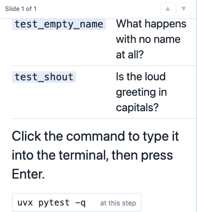
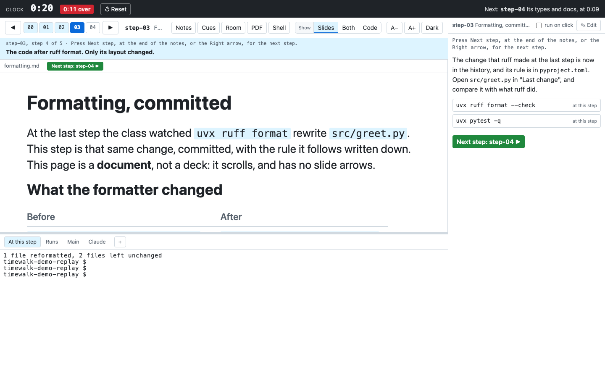

# Slides and documents

A slide can be a Markdown file, a picture, a page of a PDF, or a slide of an HTML deck. A manifest is a
TOML file that says which slides go with which step. A step can also show one longer Markdown document in
place of slides.

## The manifest

```toml
deck = "talk.md"                               # optional: the deck that bare numbers refer to

[slides]
step-00 = ["opening.md"]                       # every slide in that file
step-01 = ["tools.md#1-3", "pictures/a.svg"]   # slides 1 to 3 of a file, then a picture
step-02 = ["handout.pdf#page=2"]               # one page of a PDF
step-04 = [7, "8-10"]                          # slides of the default deck

[docs]
step-03 = "walkthrough.md"                     # one whole Markdown document instead of slides
```

Start timewalk with `--slides slides/slides.toml`. Each path is relative to the manifest.

| Entry | Means |
|---|---|
| `"talk.md"` | every slide in the file, in order |
| `"talk.md#2"` | the second slide of the file |
| `"talk.md#2-4"` | the second to the fourth slide of the file |
| `"picture.svg"`, `.png`, `.jpg`, `.gif`, `.webp` | a picture as a slide |
| `"deck.pdf#page=3"` | a page of a PDF |
| `"deck.html#/3"` | a slide of an HTML deck, with the fragment that the deck uses |
| `7`, `"8-10"` | with `deck = "talk.md"`, those slides of that deck (pages, if the deck is a PDF) |
| `"guide.md#doc"` | the whole file as one document, as under `[docs]` |

A step with no entry shows only the code.

## How to write Markdown slides

**A line that is exactly `---` starts the next slide.** The rest is usual Markdown. For example, you can
use headings, lists, tables, links, bold, `code` and fenced code. A fence that names a language gets
colours for its syntax. A picture is ``, with the path relative to the slide file. For a
horizontal rule inside a slide, write `***`.

```markdown
## The title of the first slide

- A point
- Another, with `code` and **bold**

---

## The second slide


```

Keep a slide to about six bullets or one table. On the page, a long slide scrolls. In the PDF,
the slide shrinks to fit its page.

The page reloads the slides by itself. When you save the manifest or a slide file in your editor, every
window draws the current slide again within about a second. The scroll position stays. You do not need
to reload the page.

## Commands on a slide

A Markdown slide, or a document, can hold commands that the reader runs from the page. Write each command
on a line of its own, in the same form as in the notes:

```markdown
## Its tests

Click the command to type it into the terminal, then press Enter.

$ uvx pytest -q
runs$ just train configs/cheese.yaml
main$ git log --oneline
```

Each command is a button at its place on the slide. A click types the command into its terminal, and
**run on click** in the notes column also presses Enter. The prefix chooses the tab, as in
[Notes](notes.md#what-a-notes-file-holds). Use `$ ` for **At this step**, `runs$ ` for **Runs**, and
`main$ ` for **Main**.



A `$ ` line inside a fenced code block stays code, so a slide can show a command without a button. In
the PDF, each command prints as code.

## A document instead of slides

A step under `[docs]` shows one whole Markdown file in the slide pane:

- The document does not split at `---`. There, `---` is a usual horizontal rule.
- The document keeps the text size of the slides, and the pane keeps its size. So the document scrolls.
- The page hides the slide arrows, and the Up and Down keys scroll the document.
- The document replaces any `[slides]` entry for that step.

Use a document for a walkthrough, a reading, a comparison, or other text that is too long for a slide. For
example, step-03 of the demo shows the document `demo/slides/formatting.md`.



### A document among slides

To put a document among the slides of a step, add `#doc` to its entry under `[slides]`:

```toml
[slides]
step-05 = ["talk.md#4", "walkthrough.md#doc", "talk.md#5"]
```

On the document, **Up** and **Down** scroll it, even though the step has other slides. To change the
slide, press Alt with **Up** or **Down**, or click a slide arrow.

## A PDF of the slides

The **PDF** button in the step bar makes a PDF of the slides, with the notes of each step after its
slides. The browser then downloads it. timewalk draws the PDF with the browser on your machine, through
Playwright, so it takes a few seconds.

To make the PDF from the command line, run `timewalk-pdf`:

```
timewalk-pdf slides/slides.toml -o handout.pdf --title "My talk" --notes notes.md
```

The command writes every slide in step order, one slide per page. The footer of each page names the deck,
the step and the page.

- The PDF shows Markdown slides and pictures as the browser shows them.
- A slide with too much content shrinks to fit its page.
- The pages of a PDF deck come directly from that PDF.
- A document continues over as many pages as it needs, under the name of its step.
- Without `--with-notes`, the command reads `--notes` only for the title of each step, for the footer.

### The notes in the PDF

Add `--with-notes` to put the notes of each step after its slides, as the **PDF** button does:

```
timewalk-pdf slides/slides.toml --notes notes.md --with-notes
```

The notes show the prose, the cues in their own shade, and the commands in code blocks. The PDF leaves out
the `time:` lines.

The manifest is optional with `--with-notes`. Without a manifest, the PDF holds only the notes, as a
runbook. A runbook is a written script of each step, with its prose and commands. The command writes
`notes.pdf` beside the notes file:

```
timewalk-pdf --notes notes.md --with-notes
```

### What the command needs

The command needs Chrome or Edge, and it finds either one on your machine. If you have neither, run
`uvx playwright install chromium` one time. In the timewalk folder,
`just pdf slides/slides.toml -o handout.pdf` does the same thing as the first command.
