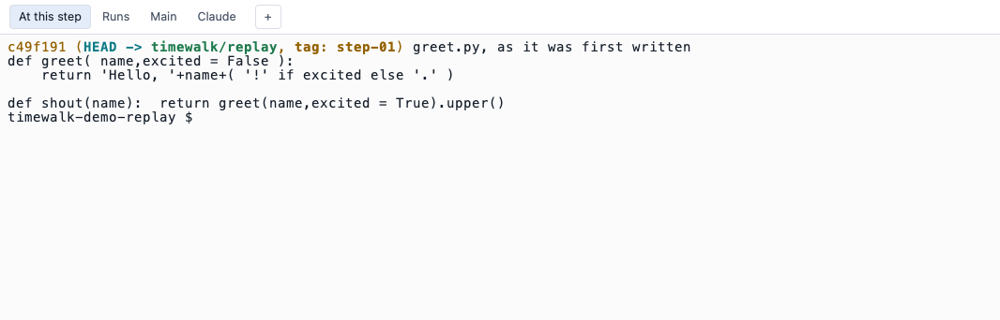
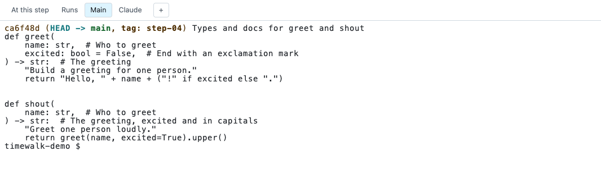
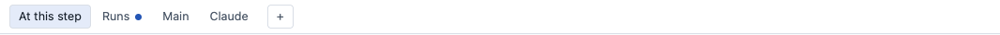
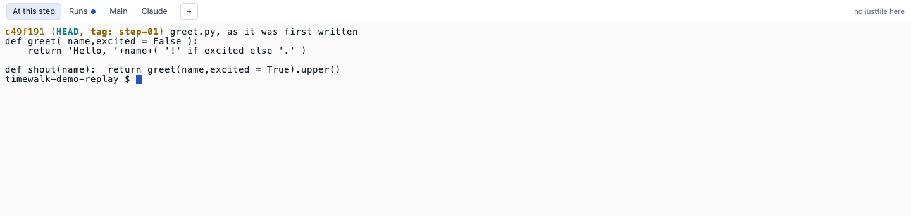
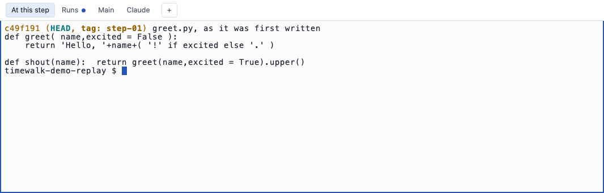

# The terminals

Each tab runs your own `$SHELL` as a login shell, which is a shell that runs your startup files. The shell
runs on your machine in a pseudo-terminal. A pseudo-terminal is a terminal device that a program makes in
place of a window. The ghostty-web library draws the terminal on the page, with the terminal core of
Ghostty. The tabs differ only in the
folder where the shell starts.

| Tab | Starts in | Its edits show in the file list |
|---|---|---|
| **At this step** | the replay copy, at the current step | yes, live, as **edited** |
| **Runs**, **Runs 2** to **Runs 9** | the replay copy | yes |
| **Claude** | the replay copy, and runs `claude` | yes |
| **+** (Shell 1 to 9) | the replay copy | yes |
| **Main** | your repository, on its own branch | no |

A shell starts the first time you open its tab. The shell continues to run when you move between
steps and when you reload the page. When a page connects again, it gets the recent output of the shell
again.

Every window on the page shows the same shells, and not copies of them. For example, you can open one
window on the projector and one on your own screen. When you type in either window, the keys go to the one
shell, and every window shows its output. The windows also share the tab in front.

A shell has one size. The window that you last typed in sets it. Another window draws the shell in the
space that it has, so a long line can wrap at a different place there.

## At this step and Main

The two pictures show the same command in the two tabs, with the replay copy at step-01.





**Main** shows the finished project while the replay copy stands at an earlier step. For example, it can
show the log, the tests, or the last form of a file. A change in **Main** changes your own repository, and
the page never shows that change.

## Runs

**Runs** is for a command that takes a long time, for example a training run. The command continues in
**Runs** while you work in **At this step**. A `runs$` line in the notes file types its command into **Runs**.
The lines `runs2$` to `runs9$` open more Runs tabs, for a second or third long command at the same time.

When a tab prints output while another tab is in front, the tab gets a dot. The dot tells you that a run
has finished.



### A long command and a move

A command continues when you move to another step, and the files change under it. The program keeps
what it loaded before the move, but a file that it reads after the move comes from the new step. For
example, a config file, a module that the program imports late, or a script that a recipe starts all come
from the new step. During a run, move to another step only after the run has read all the files it needs.
The files of the **Main** tab do not move. But **Main** runs the current code of your repository, and not
the code of the step.

### A long command when timewalk stops

When timewalk stops, its shells end, and the commands in them end in the usual way. The exception is a
command that you start with `nohup` and `&`. `nohup` makes a program ignore the signal that a terminal
sends when it closes, and `&` runs the program in the background. Such a command leaves the shell and continues.

| Started in a timewalk tab as | When timewalk stops |
|---|---|
| `just train` | Stops |
| `sleep 600 &` | Stops |
| `nohup sleep 600 &` | Continues |
| `nohup sleep 600 > run.log 2>&1 < /dev/null &` | Continues |

If a run must continue after the class, start it detached from the shell. A recipe can do it:

```just
# Start training in the background; it keeps running if the terminal or timewalk goes away
train-detached config:
    nohup just train {{ config }} > runs/train.log 2>&1 < /dev/null &
```

**Redirect all three streams.** The three streams are the input, the output and the errors of the
program.

Without the redirects, the recipe still returns at once in a timewalk tab, because a tab is a
terminal. But the output of the recipe can go to a pipe, for example in `just train-detached x | tee`, in a
script, or in CI. Then the background process holds the pipe open, and the recipe waits until the process
ends. With the redirects, the recipe returns at once in every case. Follow the run with
`tail -f runs/train.log`.

A detached run has no connection to a tab. No tab gets a dot when the run finishes, and you must stop the
run with `kill`. The run still reads its files from the folder where it started. So a move to another step
changes those files under it, as the section above says.

## Claude

**Claude** starts [Claude Code](https://claude.com/claude-code) in the replay copy. You can then ask
questions about the code at the current commit. `--assistant aider` starts a different tool in the tab.
`--assistant ''` gives a plain shell.

## The prompt after a move

Your prompt may show the git state, for example the commit of HEAD. A shell draws its prompt only when it
waits for a command, so after a move the old prompt would still show the old commit. So after a move,
timewalk presses Enter in each shell at the step that is idle. The shell then draws a new prompt, with the
new commit.

timewalk presses Enter only in a shell that meets three conditions:

- **It is at the step.** The shell runs in the replay copy. The **Main** tab does not move, so it gets
  nothing.
- **It waits for a command.** The shell itself is in front, and no program runs in it. A training run in
  **Runs**, or Claude in the **Claude** tab, never gets the Enter.
- **Its command line is empty.** If you typed part of a command, timewalk leaves it alone. After an arrow
  key or Tab, timewalk cannot tell what is on the line, so it waits until your next Enter.

An Enter on an empty line runs nothing, and adds nothing to the history of the shell.

## Which tab has the keyboard

The page keeps the arrow keys, for steps and slides, until you click in a terminal. Then that terminal
gets every key, and shows a blue edge. To give the keys back to the page, click anywhere else. A terminal
also gets the keys when you change to its tab. A click on a command in the notes column also gives its
terminal the keys, in the window where you clicked. Alt with an arrow key moves the steps and slides, also
from inside a terminal.





## The shells' environment

The shells get your environment with two additions, `TERM=xterm-256color` and `TIMEWALK=1`. They do not get
the Python of timewalk. When uv runs timewalk, it puts the environment of timewalk first on `PATH`, and names
it in `VIRTUAL_ENV`. `PATH` is the list of folders where a shell looks for programs. The server of timewalk
removes the two changes from the shells. So `python`, `pytest` and other tools come from the project or from you, and never from
timewalk.

Each shell runs your startup files, so your prompt, aliases and tools are there. A tool can read
`TIMEWALK` to find out that it runs inside timewalk.
