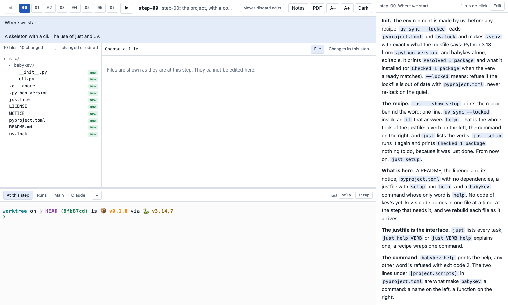
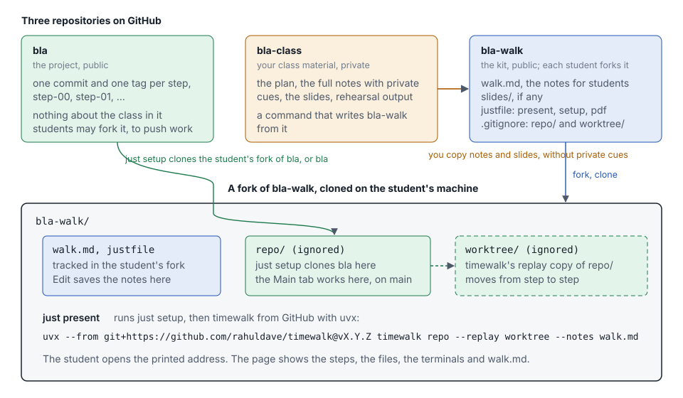

# Make a walk for a repository

A walk is a small repository, a kit, that lets anybody replay the history of a project with timewalk. A
student forks the kit, runs one command, and works through the steps with your notes beside the code.
This page shows how to keep the parts apart, how to make a kit, and what a student does with it.



## Three repositories

A walk for a project called `bla` uses three repositories. Each one holds one kind of thing.



| Repository | Holds | Who can see it |
|---|---|---|
| `bla` | The project. One commit and one tag for each step. Nothing about the class | Public. Students clone it, or fork it to push their own work |
| `bla-class` | Your material for the class: the plan, the full notes with your private cues, the slides, rehearsal output | Private, or only on your machine |
| `bla-walk` | The kit: the notes for students, the slides, a `justfile` and a `.gitignore` | Public. Each student forks it |

Keep the project clean. A student who clones `bla` sees only the project, and never your plan or your
cues. Keep the kit small. It holds only what a student needs to replay the steps.

## Get the project ready

The project needs one commit and one annotated tag for each step, on one branch. See
[Making the steps](steps.md). Push the branch and the tags to GitHub:

```
git push origin main
git push origin --tags
```

## Make the kit

Make a repository called `bla-walk` with these files, and push it to GitHub.

| File | Holds |
|---|---|
| `walk.md` | The notes of every step, as in [Notes](notes.md). The notes go to students, so remove your private cues first |
| `slides/` | The slides and the manifest, if the walk has slides. See [Slides and documents](slides.md) |
| `.gitignore` | The two folders that the kit makes on each machine, `repo/` and `worktree/`, and the PDF of the student, `walk.pdf` |
| `bla.pdf` | Optional. A PDF of the walk as you wrote it, for students who only want to read |
| `justfile` | The recipes `present`, `setup` and `pdf` |

The `.gitignore` has three lines:

```
/repo/
/worktree/
/walk.pdf
```

`just pdf` writes `walk.pdf`, the PDF of the notes of the student. Git ignores it, so a student's own PDF
never shows as a change in their fork. If the kit ships a PDF, give it another name, for example
`bla.pdf`. Then the two PDFs never collide, and a pull of your update never conflicts with the PDF of a
student.

The `justfile` names the project, its upstream owner on GitHub, and the version of timewalk. Change the
first three lines for your project, and keep the rest:

```just
project := "bla"
upstream := "your-github-name"
timewalk := "git+https://github.com/rahuldave/timewalk@v1.0.14"

[private]
default:
    @just --list --unsorted

# Open the walk: the page with the steps, the files, the terminals and the notes. Prints the address to open
present *args: setup
    #!/usr/bin/env bash
    set -euo pipefail
    slides=()
    if [ -f slides/slides.toml ]; then slides=(--slides slides/slides.toml); fi
    uvx --from "{{ timewalk }}" timewalk repo --replay worktree --notes walk.md ${slides[@]+"${slides[@]}"} {{ args }}

# Clone the project into repo/: your own fork if you have one, or else the upstream. Then fetch the tags of the steps
setup url="":
    #!/usr/bin/env bash
    set -euo pipefail
    export GIT_TERMINAL_PROMPT=0
    upstream_url="https://github.com/{{ upstream }}/{{ project }}.git"
    if [ ! -d repo/.git ]; then
        url="{{ url }}"
        if [ -z "$url" ]; then
            url="$upstream_url"
            owner="$(git remote get-url origin 2>/dev/null | sed -nE 's#.*github\.com[:/]([^/]+)/.*#\1#p')"
            mine="https://github.com/$owner/{{ project }}.git"
            if [ -n "$owner" ] && [ "$owner" != "{{ upstream }}" ] && git ls-remote --exit-code "$mine" HEAD >/dev/null 2>&1; then
                url="$mine"
            fi
        fi
        echo "setup: cloning $url into repo/"
        git clone --quiet "$url" repo
    fi
    if ! git -C repo remote get-url upstream >/dev/null 2>&1; then
        git -C repo remote add upstream "$upstream_url"
    fi
    git -C repo fetch --quiet --tags --force upstream
    echo "setup: repo/ is $(git -C repo remote get-url origin), with $(git -C repo tag -l 'step-*' | wc -l | tr -d ' ') steps from {{ upstream }}/{{ project }}"

# Make build/walk.pdf: the slides, one page each, and no notes
pdf:
    #!/usr/bin/env bash
    set -euo pipefail
    test -f slides/slides.toml || { echo "pdf: this walk has no slides" >&2; exit 1; }
    uvx --from "{{ timewalk }}" timewalk-pdf slides/slides.toml --notes walk.md --title "{{ project }}" -o build/walk.pdf
```

The kit for babykev, https://github.com/rahuldave/babykev-walk, is a complete example.

## What a student does

A student needs uv, git, just and a browser. They do these things:

1. Fork `bla-walk` on GitHub, and clone the fork.
2. In the folder of the kit, run `just present`.
3. Open the address that timewalk prints.

```
$ git clone https://github.com/student/bla-walk
$ cd bla-walk
$ just present
setup: cloning https://github.com/your-github-name/bla.git into repo/
setup: repo/ is https://github.com/your-github-name/bla.git, with 8 steps from your-github-name/bla
timewalk: 8 steps in .../bla-walk/repo
timewalk: stepping in .../bla-walk/worktree
timewalk: open       http://127.0.0.1:8765/?t=...
```

The first run clones the project and downloads timewalk. Later runs start at once.

## How the kit finds the project

The recipe `setup` decides where to clone from. It does this only once, when `repo/` does not exist.

1. It reads the owner of the kit from the git remote of the kit. A student who forked the kit as
   `student/bla-walk` is the owner `student`.
2. If `github.com/student/bla` exists, `setup` clones that fork. The student can then push their own work
   to it.
3. If the student has no fork of the project, `setup` clones `github.com/your-github-name/bla`.
4. In both cases, `setup` adds the upstream project as the remote `upstream`, and fetches its tags. The
   steps always come from you, even when the fork of a student has old tags.

To clone from another address, run `just setup url=<address>` before the first `just present`.

## Where the work of a student goes

A student saves two kinds of work, in two places.

- **Notes.** **✎ Edit** in the notes column saves the notes of the step in `walk.md`. The student commits
  `walk.md` and pushes it to their fork of the kit.
- **Code.** The **Main** tab is a terminal in `repo/`, on the `main` branch of the project. A move never
  touches `repo/`. The student commits there, and pushes to their own fork of the project.

The terminals **At this step** and **Runs** work in `worktree/`, the replay copy. A move keeps the edits
and the commits made there on a saved branch in the replay copy. The window of the student then says how
to get them back. Use those terminals to run the step, and not to keep work. See
[The replay copy](replay.md#saved-branches).

## Keep the kit up to date

- **After you change the notes or the slides**, copy them from `bla-class` to `bla-walk` again, and push.
  Students pull the change into their fork.
- **After you move a tag**, push the tags of the project. A student runs `just present` again. Then
  `setup` fetches the new tags, and timewalk reads them when it starts.
- **For a new version of timewalk**, change the version after `@` in the `justfile` of the kit.

## Private cues

timewalk shows every line of the notes file, `>` cues included. So remove your private cues before the
notes go into the kit. The class material is the place for a script that does this. A later version of
this page will show one way to do it.
