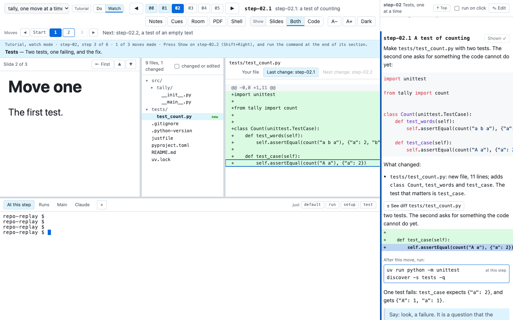
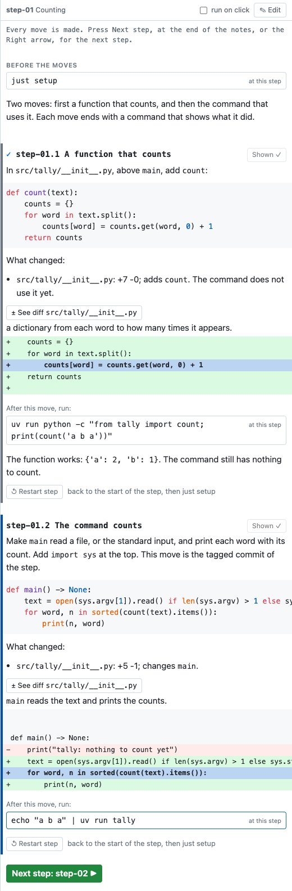
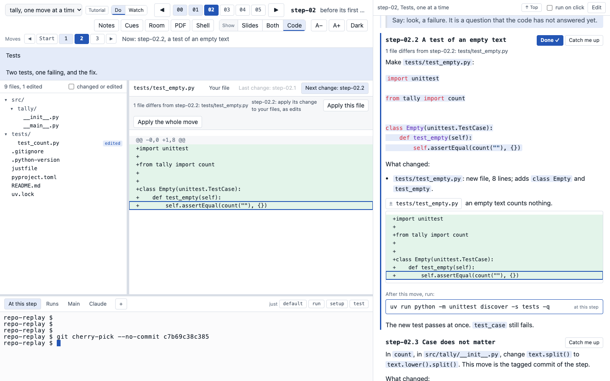

# Several walks

A walk is one path through the history of your repository, with its own notes and slides. One class can
have several walks. For example, one walk tells the whole story of the project, step by step, and a second
walk covers only the tests. A table of contents lists the walks, and a menu at the left of the step bar
changes the walk in every window.

A walk is a narrative or a tutorial. A narrative goes from tag to tag. A tutorial also stops at each small
commit between two tags, and the class makes the step one move at a time.

To build a class with several walks, see [Build a class with several walks](build-walks.md).
[What a narrative and a tutorial need](authoring.md) lists what each kind of walk needs, as checklists.

Try it on the demo. In a clone of timewalk, run `just demo-walks`. The demo has two walks. "The demo, step
by step" has all five steps, and "Only the checks" has two of them. The class timewalk-test has five
walks, two of them tutorials.


## The table of contents

The table of contents is a TOML file, `toc.toml`, in the class folder. It holds one `[[walk]]` table for
each walk. The first walk is the default.

```toml
[[walk]]
id = "story"
title = "The project, step by step"
description = "How the project was built, one tagged step at a time."
kind = "narrative"
notes = "notes.md"
slides = "slides/slides.toml"

[[walk]]
id = "tests"
title = "Only the tests"
description = "Three steps of the project: the code, its tests, and a fix."
kind = "narrative"
folder = "walks/tests"            # its notes.md, and slides/slides.toml, are in this folder
steps = ["step-01", "step-02", "step-05"]
```

| Key | Holds |
|---|---|
| `id` | The name of the walk, for `--walk`. Letters, digits, `-` and `_` |
| `title` | What the menu shows. Default: the `id` |
| `description` | Optional. What the walk is about, in a sentence or two. The status band shows it at the first step of the walk. See [The status band](page.md#the-status-band) |
| `kind` | `"narrative"`: the tagged steps, and nothing between them. `"tutorial"`: the tagged steps, and the small commits between them. See [Tutorial walks](#tutorial-walks). Default: `"narrative"` |
| `notes` | The notes file of the walk |
| `slides` | The slides manifest of the walk |
| `folder` | A folder for the walk. Its notes are `notes.md`, and its manifest is `slides/slides.toml`, in this folder |
| `steps` | Optional. Some of the steps, by name. Without it, the walk has every step. A tutorial cannot have `steps` |
| `tags` | Optional. A glob for tags of its own, for example `"parts-*"` on another branch. Give `steps` or `tags`, not both |
| `setup` | `"manual"`: you run `just setup` yourself at each step. The only value for now |
| `moves` | In a tutorial, the mode that it starts in. `"do"`: the learner makes each move by hand. `"watch"`: timewalk checks out the commit of each move. See [Do mode and watch mode](#do-mode-and-watch-mode). Default: `"do"` |
| `sync` | In a tutorial, `true` or `false`. With `true`, the slides and the moves follow each other. Default: `true` |

timewalk reads every path from the folder of `toc.toml`. Give a walk `folder`, or give it `notes` and
`slides`. A walk can also have no notes, or no slides. In a folder, `notes.md` and `slides/slides.toml` are
each optional.

## A class folder with several walks

Keep the files of each walk in its own folder. The default walk can stay at the top, as in a class with
one walk:

```
my-class/
  toc.toml
  notes.md                    the default walk
  slides/slides.toml          its slides, and the slide files
  walks/
    tests/
      notes.md
      slides/slides.toml      it can name ../../../slides/talk.md#3
```

A manifest of one walk can use the slide files of another. Write the path from the folder of the
manifest, for example `../../../slides/talk.md#3`. The page serves slides only from the slides folders of
the walks.

Put every slide file there, and every picture that a slide shows. Keep each manifest in a slides
folder of its own, not at the top of the class folder. Keep the notes out of the slides folders. The page
never serves the notes or `toc.toml`, and the checks report a layout that would. See [Slides and documents](slides.md#the-manifest) for the entries.

## Start timewalk with a table of contents

Give `--toc` in place of `--notes` and `--slides`:

```
timewalk ~/code/project --toc my-class/toc.toml
timewalk ~/code/project --toc my-class/toc.toml --walk tests
```

timewalk starts on the first walk, or on the walk that `--walk` names. Each walk names its own tags, so
`--toc` does not go with `--tags` or `--commits`.

## Change the walk

Choose a walk in the menu at the left of the step bar. Every window changes to the steps, the notes and
the slides of that walk.

- **The menu** shows only when the table has two walks or more. If the table has both kinds of walk, the
  menu puts them in two groups, **Narratives** and **Tutorials**. Each group keeps the order of the table.
- **A label** beside the menu says the kind of the walk on show, **Narrative** or **Tutorial**.
- **In a tutorial,** a switch beside the label changes the mode, **Do** or **Watch**.
- **The Room window** has no menu. It shows the title of the walk, with its kind, and for a tutorial its
  mode, for example "(tutorial, watch mode)".
- **The status band** under the step bar names the kind of the walk and the step. At the first step of
  the walk, it also shows the `description` of the walk. A sentence after it says what the kind of walk
  asks of you. See [The status band](page.md#the-status-band).

If the bar has no room for the menu, its buttons move to a second row.

A change of walk moves the replay copy, by the same rules as a move between steps:

- **If the replay copy has edits,** the move keeps them on a saved branch, named after the step on show,
  and does not ask. See [Live edits](edits.md#moving-with-edits).
- **timewalk remembers each walk.** It keeps the step, the move, the slide and the scrolls of each walk.
  When you come back to a walk, the page shows the place where you left it.

**Save** in the notes column writes the notes file of the walk on show. The **PDF** button makes the PDF of
the walk on show.

## The checks

timewalk checks every walk when it starts. An error stops timewalk, and a warning prints and does not.
Run the same checks alone with `timewalk-check`:

```
timewalk-check ~/code/project --toc my-class/toc.toml
timewalk-check ~/code/project --notes notes.md --slides slides/slides.toml
```

The second form checks a class with one walk and no table. `timewalk-check` prints one line for each
problem, and exits with code 1 when it finds an error.

| Problem | Gives |
|---|---|
| A notes section or a slides entry for a step that is not in the walk | An error |
| In a tutorial, a move whose subject does not start with its name, for example `step-02.1:` | An error |
| In a tutorial, a move with no `###` section, a `###` section for no move, or sections out of the order of the commits | An error |
| A `moves` value other than `"do"` or `"watch"`, and other mistakes in `toc.toml` | An error |
| A step with no entry in `slides.toml`. Give each step one slide or more | An error |
| A slide file that does not exist, or that is not in a slides folder of a walk | An error |
| A picture that a Markdown slide shows from outside the slides folders | An error |
| A manifest at the top of the class folder, or notes in a slides folder | An error |
| A slide number past the end of its Markdown file, or a page past the end of its PDF | An error |
| A notes file or a manifest inside your repository or its replay copy | An error |
| A step with no section in the notes | A warning |
| In a tutorial, a move whose section has no command | A warning |
| In a tutorial, a `diff` item for a file that its move does not change, or a `file` item for a file that is not in the commit of its move | A warning |
| In a tutorial, a `show:` line that is no longer in the change of its item | A warning |
| In a tutorial, an item that names a move that is not in the walk | A warning |
| A slide file in a slides folder that no walk uses | A warning |

A picture that a Markdown slide shows counts as used.

## Tutorial walks

A tutorial walk stops at every small commit between two steps. Each small commit is a move. A tutorial
has one or more steps, and each step has zero or more moves. The class makes the moves of a step one at a
time, and reads the notes of each move.

The moves of a step are the commits after the step before it, up to the commit of the step, on the
first-parent line. The first-parent line is the line of commits that git follows back from a commit
through the first parent of each merge. The last move is the commit of the step, with its tag. A step of
one commit has no moves, and the first step has none.

Write the subject of each commit with the name of its move, for example `step-02.1: a test of counting`.
The commit of the step keeps its own subject, for example `step-02: the tests pass`. A subject with the
wrong name is an error in the checks.

```
step-01: count the words              tag step-01
step-02.1: a test of counting         move step-02.1
step-02.2: a test of an empty text    move step-02.2
step-02: the tests pass               tag step-02, move step-02.3
```

A tutorial takes every tag of its glob, so it cannot have `steps`. For a tutorial on one part of the
history, give the part tags of its own on a branch, and name them with `tags`.

### The notes of a tutorial

Give each move a `### step-NN.k Title` section, in the order of the commits. Here `NN` is the number of
the step and `k` is the number of the move. A move section holds these parts:

- **The instructions** to make the move by hand, with the code to type.
- **The files changed,** a list that starts "These are the files changed:". Each item is one file, its
  path as it is, then what happened to it. `timewalk-notes` drafts it from the diff. See [Draft the notes of the moves](#draft-the-notes-of-the-moves).
- **A line `files:`, with items.** Each item is one file to look at, with words that say why. A `show:`
  line under an item quotes the main line of the change. See [The items under files](#the-items-under-files).
- **One or more commands at the end,** with the result to expect. They are the anchor of the move.

````markdown
## step-02 Tests, one at a time

$ just setup

We add the tests one file at a time, and run them after each.

### step-02.1 A test of counting

Make `tests/test_count.py` with two tests:

```python
...
```

This is the file changed:

- `tests/test_count.py`: a new file of 11 lines; adds `class Count`, `test_words` and `test_case`.

files:
- diff `tests/test_count.py`: two tests. The second asks for something the code cannot do yet.
  show: `self.assertEqual(count("A a"), {"a": 2})`

$ uv run python -m unittest discover -s tests -q

One test fails: `test_case` expects `{"a": 2}`.
````

### Anchor commands

The last commands of a move section are its anchor commands. An anchor command shows what the move did,
for example a test run or a run of the program. The notes column shows them under the label "After this
move, run:".

- **Make each anchor command safe to run again.** It must not change files that git tracks.
- **Say what the command gives.** A test that fails is a good anchor, if the notes say that it fails and
  why.

`timewalk-check` warns of a move whose section has no command.

### Do mode and watch mode

A tutorial has two modes. Every window shares the mode. The switch **Do** or **Watch** beside the label
of the walk changes it, at any step and at any time. The key `moves` in `toc.toml` sets the mode that the
tutorial starts in.

- **Do mode** is the default. The learner makes each move by hand from its notes. The code does not move
  until the learner asks.
- **Watch mode** checks out the commit of each move when you ask. The learner reads the change, and runs
  the anchor commands.

A move to a tagged step always starts that step at the tag before it, with no move made. So in both modes,
each step starts from the code of the step before.


In do mode, each move section has these buttons:

| Button | Does |
|---|---|
| **Done ✓** | On the move that the learner works on: marks it done, and goes on to the next move. The code does not move |
| **⇥ Catch me up** | On the move that the learner works on: checks out the commit at the end of that move, in every window. If the replay copy has edits, the move keeps the work of the learner on a saved branch first. It never discards them |
| **Made ✓** | On a move already made, in place of **Done ✓**. It is grey, and does nothing |

The moves go in order, in both modes. A step starts with `just setup`, so any step is a safe place to
start. A move has no setup of its own, so it builds on what the moves before it did to the environment. A
skip would miss that. So the moves after the next one are grey, and their buttons, commands and items do
nothing. The way back is the step's **Start**, or **↺ Restart step** in the notes, and then `just setup`.

An item under `files:` opens the change of its move in the reader, even before the file exists. In do
mode, the reader then shows the change in the tab **Next change**, with an **Apply** bar. See
[The reader in a tutorial](#the-reader-in-a-tutorial) and [Apply](#apply).



In watch mode, the next move has a **Show ▶** button. It checks out the commit of that move, in every
window. If the replay copy has edits, the move keeps them on a saved branch first. A move already shown
has a grey **Shown ✓** button in its place, which does nothing.

### Moves on the page

When a step has moves, a row of moves shows under the step bar, in every window. It has the arrows ◀ and
▶, and a button for each place. The buttons are **Start**, then **1**, **2** and so on. **Start** is the place before the
first move. Beside the buttons, the row shows the move on show and its subject.

| Control | In do mode | In watch mode |
|---|---|---|
| **▶**, or Shift+Right | Marks the move done, and goes to the next | Checks out the commit of the next move |
| **◀**, or Shift+Left, or **Start** | Checks out the tag before the step, and marks no move done. Edits go on a saved branch first | Checks out the tag before the step |
| The number of the next move | The same as **▶** | The same as **▶** |
| Other numbers | Do nothing: the moves go in order | Do nothing: the moves go in order |

After **Start**, run `just setup`, as the first line of the notes says.

- **In a terminal,** use Alt with Shift+Right and Shift+Left.
- **Right and Left** go to the next or the previous step, as in a narrative.
- **The status band** gives the mode, the step and the count of moves made. It then says what to do now,
  for example "press Show on step-02.1". The first line of the notes says the same thing.
- **The notes** scroll to the section of the move on show, in every window. At **Start**, they go to the
  top, where `just setup` is.
- **Last change** and **Next change** in the reader follow the moves. See
  [The reader in a tutorial](#the-reader-in-a-tutorial).

In the notes, the sections of the moves have no boxes. Each section runs from edge to edge of the column,
with a bar on its left:

| Section | Looks |
|---|---|
| The text before the first move | A section of its own, with the label "Before the moves" and no bar. The text is about the whole step |
| A move made | A grey bar, and a check before its name |
| The move on show | A dark bar |
| The next move | A blue bar |
| A move after the next | Faded, with no bar |

Once a move is made, each section of a move made ends with **↺ Restart step**, and so does the section of
the move on show. The button goes back to the step's **Start**, in every window, as **Start** does. The
code goes back to the step before. If the replay copy has edits, the move keeps them on a saved branch
first. Then run `just setup` again.

When every move of the step is made, a green **Next step** button ends the notes, with the name of the
next step. The same button shows in the head of the slides, at the last slide. The Room window does not
show the button on the slides.



timewalk writes down the move on show in the git folder of the replay copy. After a restart, the page
comes back at the same move. [What timewalk does with git](git.md#what-is-checked-out-and-when) says what
each mode checks out, and when.

### The items under files

A line `files:` in a move section starts a list of items. An item is one file to look at, with words
that say why. The words are written by hand, but the change that an item opens comes from the commits,
each time the page draws it. So no diff is copied into the notes.

```markdown
files:
- diff `src/tally/__init__.py`: one word, `lower()`, answers the failing test.
  show: `for word in text.lower().split():`
- file `tests/test_count.py`: read `test_case` again. It passes now.
```

| Line | Does |
|---|---|
| ``- diff `path`: words`` | A button **± See diff path** that opens the change of the move to that file, and its words |
| ``- file `path`: words`` | A button **▤ See file path** that opens the file itself, and its words |
| ``- diff step-02.1 `path`: words`` | The same for another move, named before the path |
| ``  show: `a line` `` | Under an item: a line of the change, quoted. The notes draw it as an excerpt, and the reader marks it |
| An indented line under an item | More of the words of the item |

On the page, each item is one button with an icon, a verb and the path. The button is **± See diff** for
a `diff` item, and **▤ See file** for a `file` item. The words of the item go on the line under the button. A
**± See diff** button opens the tab of the reader that holds the change:

- **Next change** for the move that the learner works on.
- **Last change** for the move just made.
- **Changes in step-02.1** for any other move.

A **▤ See file** button opens **Your file**. In do mode, the button of a move that is not made yet opens
**At step-02.3** instead. The view shows the file as the move leaves it, read only.

A `show:` line names one line of the change by its text. Under a `diff` item, the notes draw an excerpt
of the real diff there. An excerpt is a small part of the diff, read only. It holds the line and two
lines of context on each side, or the whole hunk when the hunk is about eight lines or fewer. A hunk is
one run of changed lines in a diff. When the item opens the reader, the reader marks the same line.

The excerpt is a band across the whole column, and the named line is shaded. A click on the excerpt opens
the change, as the button of its item does. In a move after the next one, the click does nothing.


If a `show:` line is no longer in the change, the notes draw a red band that says so. A click on the band
opens the change too. A fix to the history can remove a quoted line. `timewalk-check` warns of it too.

A line `files:` with no items under it shows a **± See diff** button for each file that the commit of
the move added or changed. Items also work in a narrative. There, a `diff` item opens **Last change**, the change of the
step. The PDF prints each item line as it is written.

### The reader in a tutorial

In a tutorial, the reader has up to five views. Two views read the disk, and two compare commits. The
label of each change names its move.

| View | Shows |
|---|---|
| **Your file** | The file in the replay copy, as the learner left it |
| **At step-02.3** | The file as a move leaves it, read only. It shows only when a `file` item of a move that the learner has not made opens it, in do mode |
| **Last change: step-02.2** | The move before, to this one: the change of the move just made |
| **Next change: step-02.3** | This move, to the next one: the change of the move to make now. It is empty at the last move of a step |
| **Your edits** | The edits since the commit that the replay copy stands on |

In do mode, the code does not move, so **Last change** and **Next change** follow the moves marked
done. In watch mode, they follow the move on show. At **Start**, no move is made, so **Last change** is
empty and **Next change** is the first move.

In a narrative, **Last change** compares the step before with this step. **Next change** compares this
step with the next step, before you move to it.

### Apply

In do mode, the **Next change** tab has an **Apply** bar. Apply makes the change of the next move in the
learner's files. It types a git command into the **At this step** tab, and runs it. The learner sees
exactly what ran.

| Button | Types into the shell |
|---|---|
| **⇣ Apply this file** | ``(cd "$(git rev-parse --show-toplevel)" && git diff A B -- path \| git apply --3way)``, where `A` is the commit before the move and `B` is the commit of the move |
| **⇣ Apply the whole move** | `git cherry-pick --no-commit B`, for the commit `B` of the move |

- **The changes become edits.** HEAD stays where it is. HEAD is the commit that the replay copy stands
  on. The file list marks the files, and **Your edits** shows them.
- **A button is disabled** when the learner has already changed a file that it touches. The bar then
  says to compare the file with **Next change**, or to use **⇥ Catch me up**.
- **The page itself never writes a file.** The shell runs the command, as any terminal does.
- **The Room window has no Apply bar.**



### Your files match

In do mode, the page asks timewalk every two seconds if the learner's files match the commit of the move
that the learner works on. The answer shows on the section of that move, and in the Apply bar:

- **"Your files match step-02.3 ✓"** when every file is the same as in the commit.
- **"2 files differ from step-02.3: a.py, b.py"** with the names of the files that differ.

A match marks the move done by itself, once for each move. Only your own window marks the move, and never
the Room window.

The comparison is by content. It takes every file that differs between HEAD and the commit of the
move, and every file with edits. A new file of the move counts, even when git does not track it yet. The
comparison is strict, so one extra space is a difference. It is a hint and never a gate. **Done ✓**
still marks a move done when the learner made it another way.

### Slides for moves

A move can have slides of its own in `slides.toml`. Quote its name, because it holds a dot:

```toml
[slides]
step-02 = ["talk.md#3"]
"step-02.1" = ["moves.md#1"]
"step-02.3" = ["moves.md#2"]
```

The slides of a step are its own slides, then the slides of each move, in order. With `sync`, the slides
follow the moves:

- **A move shows its first slide.** A move without slides keeps the slide before it.
- **In do mode,** **Done ✓** shows the first slide of the next move, if that move has slides.
- **In watch mode,** a slide of another move also checks out that move. A slide of the next move makes
  that move, and a slide of an earlier move goes back to it. A slide that is further ahead makes only the
  next move.

Write `sync = false` at the top of `slides.toml`, before `[slides]`, to keep the slides and the moves
apart. The key `sync` in `toc.toml` does the same for the walk, and the manifest wins.

### Draft the notes of the moves

`timewalk-notes` writes a first draft of the section of each move that the notes do not have yet:

```
timewalk-notes ~/code/project --toc my-class/toc.toml --walk tutorial
timewalk-notes ~/code/project --toc my-class/toc.toml --walk tutorial --write
```

Without `--write`, it prints only the drafts. With `--write`, it writes them into the
notes file of the walk. A section that is already in the notes stays as it is. Each draft has these
parts:

- **A heading** `### step-NN.k`, with the subject of the commit after its name as the title. A step that
  has no section yet gets one too, `## step-NN Title`, with the first line of its tag's message, steps
  without moves too. A walk whose folder has no `notes.md` yet gets one.
- **"These are the files changed:"**, a list with one item for each file of the commit ("This is the file
  changed:" for one). An item says if the file is new
  or removed, or how many lines the commit added and removed. For Python, it names the functions and
  classes that the commit added, removed or changed. For a `justfile`, it names the recipes that the
  commit added.
- **A line `files:`, with items.** It drafts a `file` item for each new file, and a `diff` item for each
  changed file. The words of each item are left for you to write. It writes no `show:` lines.
- **A comment** that asks for a command, for you to replace with an anchor command.

The list names only what the diff shows. Finish each draft by hand. Write the instructions and the words
of each item. Quote the main line of each change with `show:`, and add the anchor commands.

## A PDF of one walk

`timewalk-pdf` takes the slides and the notes of one walk from the table:

```
timewalk-pdf --toc my-class/toc.toml --walk tests -o tests.pdf
```

Without `--walk`, it makes the PDF of the first walk. The title of the walk goes in the footer, unless you give `--title`. `--brand` and `--with-notes` work as for one walk. See
[Slides and documents](slides.md#a-pdf-of-the-slides).
