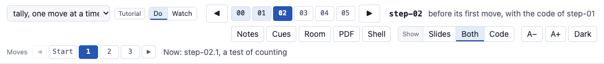

# Several walks

A walk is one path through the history of your repository, with its own notes and slides. One class can
have several walks. For example, one walk tells the whole story of the project, step by step, and a second
walk covers only the tests. A table of contents lists the walks, and a menu at the left of the step bar
changes the walk in every window.

To build a class with several walks, see [Build a class with several walks](build-walks.md). Try it on the demo. In a clone of
timewalk, run `just demo-walks`. The demo has two walks. "The demo, step
by step" has all five steps, and "Only the checks" has two of them.



## The table of contents

The table of contents is a TOML file, `toc.toml`, in the class folder. It holds one `[[walk]]` table for
each walk. The first walk is the default.

```toml
[[walk]]
id = "story"
title = "The project, step by step"
kind = "narrative"
notes = "notes.md"
slides = "slides/slides.toml"

[[walk]]
id = "tests"
title = "Only the tests"
kind = "narrative"
folder = "walks/tests"            # its notes.md, and slides/slides.toml, are in this folder
steps = ["step-01", "step-02", "step-05"]
```

| Key | Holds |
|---|---|
| `id` | The name of the walk, for `--walk`. Letters, digits, `-` and `_` |
| `title` | What the menu shows. Default: the `id` |
| `kind` | `"narrative"`: the tagged steps, and nothing between them. `"tutorial"`: the tagged steps, and the small commits between them. See [Tutorial walks](#tutorial-walks). Default: `"narrative"` |
| `notes` | The notes file of the walk |
| `slides` | The slides manifest of the walk |
| `folder` | A folder for the walk. Its notes are `notes.md`, and its manifest is `slides/slides.toml`, in this folder |
| `steps` | Optional. Some of the steps, by name. Without it, the walk has every step. A tutorial cannot have `steps` |
| `tags` | Optional. A glob for tags of its own, for example `"parts-*"` on another branch. Give `steps` or `tags`, not both |
| `setup` | `"manual"`: you run `just setup` yourself at each step. The only value for now |
| `sync` | In a tutorial, `true` or `false`. With `true`, the slides and the moves follow each other. Default: `true` |

timewalk reads every path from the folder of `toc.toml`. Give a walk `folder`, or give it `notes` and
`slides`. A walk can also have no notes, or no slides. In a folder, `notes.md` and `slides/slides.toml` are
each optional.

## A class folder with several walks

Keep the files of each walk in its own folder. The default walk can stay at the top, as in a class with
one walk:

```
my-class/
  toc.toml
  notes.md                    the default walk
  slides/slides.toml          its slides, and the slide files
  walks/
    tests/
      notes.md
      slides/slides.toml      it can name ../../../slides/talk.md#3
```

A manifest of one walk can use the slide files of another. Write the path from the folder of the
manifest, for example `../../../slides/talk.md#3`. The page serves slides only from the slides folders of
the walks.

Put every slide file there, and every picture that a slide shows. Keep each manifest in a slides
folder of its own, not at the top of the class folder. Keep the notes out of the slides folders. The page
never serves the notes or `toc.toml`, and the checks report a layout that would. See [Slides and documents](slides.md#the-manifest) for the entries.

## Start timewalk with a table of contents

Give `--toc` in place of `--notes` and `--slides`:

```
timewalk ~/code/project --toc my-class/toc.toml
timewalk ~/code/project --toc my-class/toc.toml --walk tests
```

timewalk starts on the first walk, or on the walk that `--walk` names. Each walk names its own tags, so
`--toc` does not go with `--tags` or `--commits`.

## Change the walk

Choose a walk in the menu at the left of the step bar. Every window changes to the steps, the notes and
the slides of that walk. The menu shows only when the table has two walks or more. If the bar has no room for the menu, its buttons move to a second row. The Room window shows
the title of the walk, and has no menu.

A change of walk moves the replay copy, by the same rules as a move between steps:

- **If the replay copy has edits,** the page asks first. Then it stashes the edits, with the name of the
  step on show. With `--discard-edits`, the move drops them. See [Live edits](edits.md#moving-with-edits).
- **timewalk remembers each walk.** It keeps the step, the move, the slide and the scrolls of each walk.
  When you come back to a walk, the page shows the place where you left it.

**Save** in the notes column writes the notes file of the walk on show. The **PDF** button makes the PDF of
the walk on show.

## The checks

timewalk checks every walk when it starts. An error stops timewalk, and a warning prints and does not.
Run the same checks alone with `timewalk-check`:

```
timewalk-check ~/code/project --toc my-class/toc.toml
timewalk-check ~/code/project --notes notes.md --slides slides/slides.toml
```

The second form checks a class with one walk and no table. `timewalk-check` prints one line for each
problem, and exits with code 1 when it finds an error.

| Problem | Gives |
|---|---|
| A notes section or a slides entry for a step that is not in the walk | An error |
| A step with no entry in `slides.toml`. Give each step one slide or more | An error |
| A slide file that does not exist, or that is not in a slides folder of a walk | An error |
| A picture that a Markdown slide shows from outside the slides folders | An error |
| A manifest at the top of the class folder, or notes in a slides folder | An error |
| A slide number past the end of its Markdown file, or a page past the end of its PDF | An error |
| A notes file or a manifest inside your repository or its replay copy | An error |
| A step with no section in the notes | A warning |
| A slide file in a slides folder that no walk uses | A warning |

A picture that a Markdown slide shows counts as used.

## Tutorial walks

A tutorial walk stops at every small commit between two steps. Each small commit is a move. The class
makes the moves of a step one at a time, and reads the notes of each move.

The moves of a step are the commits after the step before it, up to the commit of the step. The last move
is the commit of the step, with its tag. A step of one commit has no moves, and the first step has none.

Write the subject of each commit with the name of its move, for example `step-02.1: a test of counting`.
The commit of the step keeps its own subject, for example `step-02: the tests pass`. A subject with the
wrong name is an error in the checks.

```
step-01: count the words              tag step-01
step-02.1: a test of counting         move step-02.1
step-02.2: a test of an empty text    move step-02.2
step-02: the tests pass               tag step-02, move step-02.3
```

### The notes of a tutorial

Give each move a `###` heading with its name, in the order of the commits. A line `files:` in a move
lists the files that its commit added or changed. Click a file to open it in the reader.

```markdown
## step-02 Tests, one at a time

We add the tests one by one, and run them after each.

### step-02.1 A test of counting
One test file arrives.

files:

$ just test
```

### Moves on the page

When a step has moves, a row of moves shows under the step bar, in every window. **Start** is the
place before the first move. A move goes forward one at a time, and back to any earlier move:

- **Shift+Right and Shift+Left** make the next move or go back one move. In a terminal, use Alt with them.
- **Right and Left** go to the start of the next or the previous step.
- **The notes** show the move on show with a line at its left. The moves after it are grey, and their
  commands and files do nothing until you make them.
- **What changed** in the reader shows what the move on show changed.

timewalk writes down the move on show in the git folder of the replay copy. After a restart, the page
comes back at the same move.

### Slides for moves

A move can have slides of its own in `slides.toml`. Quote its name, because it holds a dot:

```toml
[slides]
step-02 = ["talk.md#3"]
"step-02.1" = ["moves.md#1"]
"step-02.3" = ["moves.md#2"]
```

The slides of a step are its own slides, then the slides of each move, in order. With `sync`, a move
shows its first slide, and a move without slides keeps the slide before it. A slide of the next move makes
that move, and a slide of an earlier move goes back to it. A slide that is further ahead makes only the
next move. Write `sync = false` at the top of
`slides.toml`, before `[slides]`, to keep the slides and the moves apart.

## A PDF of one walk

`timewalk-pdf` takes the slides and the notes of one walk from the table:

```
timewalk-pdf --toc my-class/toc.toml --walk tests -o tests.pdf
```

Without `--walk`, it makes the PDF of the first walk. The title of the walk goes in the footer, unless you give `--title`. `--brand` and `--with-notes` work as for one walk. See
[Slides and documents](slides.md#a-pdf-of-the-slides).
